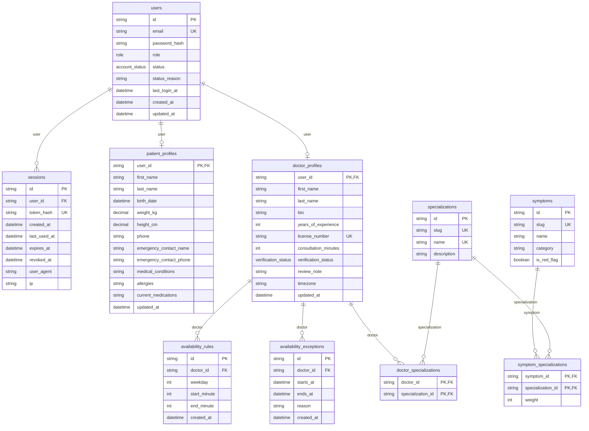

<!-- Generated by `pnpm --filter api run generate:data-model-diagram`. Do not edit by hand. -->

```mermaid
erDiagram
  users {
    string id PK
    string email UK
    string password_hash
    role role
    account_status status
    string status_reason
    datetime last_login_at
    datetime created_at
    datetime updated_at
  }
  sessions {
    string id PK
    string user_id FK
    string token_hash UK
    datetime created_at
    datetime last_used_at
    datetime expires_at
    datetime revoked_at
    string user_agent
    string ip
  }
  patient_profiles {
    string user_id PK,FK
    string first_name
    string last_name
    datetime birth_date
    decimal weight_kg
    decimal height_cm
    string phone
    string emergency_contact_name
    string emergency_contact_phone
    string medical_conditions
    string allergies
    string current_medications
    datetime updated_at
  }
  doctor_profiles {
    string user_id PK,FK
    string first_name
    string last_name
    string bio
    int years_of_experience
    string license_number UK
    int consultation_minutes
    verification_status verification_status
    string review_note
    string timezone
    datetime updated_at
  }
  availability_rules {
    string id PK
    string doctor_id FK
    int weekday
    int start_minute
    int end_minute
    datetime created_at
  }
  availability_exceptions {
    string id PK
    string doctor_id FK
    datetime starts_at
    datetime ends_at
    string reason
    datetime created_at
  }
  specializations {
    string id PK
    string slug UK
    string name UK
    string description
  }
  symptoms {
    string id PK
    string slug UK
    string name
    string category
    boolean is_red_flag
  }
  symptom_specializations {
    string symptom_id PK,FK
    string specialization_id PK,FK
    int weight
  }
  doctor_specializations {
    string doctor_id PK,FK
    string specialization_id PK,FK
  }
  users ||--o{ sessions : "user"
  users ||--o| patient_profiles : "user"
  users ||--o| doctor_profiles : "user"
  doctor_profiles ||--o{ availability_rules : "doctor"
  doctor_profiles ||--o{ availability_exceptions : "doctor"
  symptoms ||--o{ symptom_specializations : "symptom"
  specializations ||--o{ symptom_specializations : "specialization"
  doctor_profiles ||--o{ doctor_specializations : "doctor"
  specializations ||--o{ doctor_specializations : "specialization"
```
