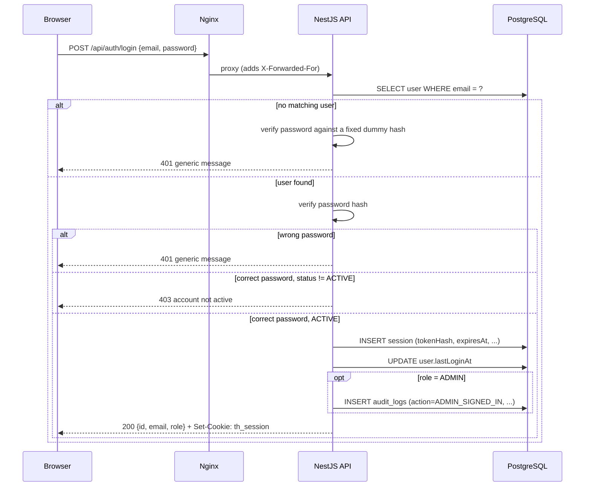
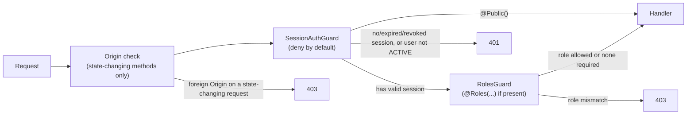

# Authentication & Authorization

Session model, request pipeline, and protections for `add-authentication`: application-managed
email/password accounts for patients and doctors, a pre-provisioned administrator, and
server-side sessions checked on every request.

## Session model

Sign-in and registration issue an opaque, random 32-byte token (base64url) in an `HttpOnly`,
`SameSite=Lax` cookie named `th_session`. The server never stores the token itself — only its
SHA-256 hash, alongside the session's owner, creation time, last-activity time, expiry, and an
optional revocation time. Every request that carries the cookie looks the session up by that
hash, so:

- **Sign-out is immediate.** Revoking a session (or all of a user's sessions) takes effect on
  the very next request — there's no token that keeps working until it expires.
- **Suspension is immediate.** If an account's status changes away from `ACTIVE`, the guard
  rejects its next request and revokes its sessions as a side effect. An administrator suspending
  or deactivating an account through the [Admin](/modules/admin#user-management) console takes the
  same path directly, calling `SessionService.revokeAllSessions` right after its transaction
  commits — which also disconnects that account's open sockets (`RealtimeGateway.disconnectSessions`),
  so a signed-in tab is kicked live, not just on its next HTTP request.
- **Expiry is two-layered.** A session stops working after 2 hours of inactivity (`lastUsedAt`)
  or 12 hours after sign-in (`expiresAt`), whichever comes first. `lastUsedAt` is only rewritten
  when it's more than a minute stale, to keep the per-request cost down.

Passwords are hashed with `@node-rs/argon2` (argon2id defaults) — never with a reversible
scheme, and never logged (see [Protections](#protections)). Sign-in verifies against a fixed
dummy hash when the email doesn't match any account, so a wrong password and an unknown email
take the same amount of time and get the same generic error.

## Sign-in sequence

The `lastLoginAt` update, the session insert, and (for an administrator) the audit entry all run
inside one transaction (`AuthService.login`), so a signed-in administrator's session and its
`ADMIN_SIGNED_IN` audit entry can never exist independently of each other — see the
[Admin](/modules/admin#audit-log) module page and [Data Model](/architecture/data-model) for the
audit log's own append-only guarantee.

## Request pipeline

Every request passes through the same guard order, registered once as global `APP_GUARD`s so a
new controller is protected by default:

`SessionAuthGuard` denies every route unless it carries `@Public()`; the public routes in this
change are health, the Swagger UI/document (served directly by `SwaggerModule`, so the guard
never runs on them), the specialization catalog, and registration/sign-in. On success it attaches
`request.user: { id, email, role, sessionId }`, read by the `@CurrentUser()` decorator.
`RolesGuard` then checks `@Roles(...)` metadata, if any, against that user's role. Self-service
endpoints (`/patients/me/profile`, `/doctors/me/profile`, `/auth/me`) take no ID from the caller,
so a user can only ever act on their own record.

## Role matrix

| Endpoint                        | Public | PATIENT | DOCTOR | ADMIN |
| -------------------------------- | :----: | :-----: | :----: | :---: |
| `GET /health`                    |   ✓    |    ✓    |   ✓    |   ✓   |
| `GET /specializations`           |   ✓    |    ✓    |   ✓    |   ✓   |
| `POST /auth/register/patient`    |   ✓    |    —    |   —    |   —   |
| `POST /auth/register/doctor`     |   ✓    |    —    |   —    |   —   |
| `POST /auth/login`               |   ✓    |    —    |   —    |   —   |
| `POST /auth/logout(-all)`        |   —    |    ✓    |   ✓    |   ✓   |
| `POST /auth/password`            |   —    |    ✓    |   ✓    |   ✓   |
| `GET /auth/me`                   |   —    |    ✓    |   ✓    |   ✓   |
| `GET/PATCH /patients/me/profile` |   —    |    ✓    |   —    |   —   |
| `GET/PATCH /doctors/me/profile`  |   —    |    —    |   ✓    |   —   |

There is no public way to create or promote an account to `ADMIN`: registration DTOs don't
accept a `role` field at all, and the global `ValidationPipe` (`forbidNonWhitelisted`) rejects
any request that includes one with `400`. The administrator account only ever comes from
`scripts/provision-admin.ts` (see [Deployment](/architecture/deployment)).

## Protections

- **Rate limiting.** Sign-in (10/minute) and each registration endpoint (5/minute) are limited
  per client IP by an in-memory `RateLimitGuard`, applied only to those routes — everything else
  is unthrottled. The client IP is `req.ip`, which respects Express's `trust proxy` setting, so
  it reflects `X-Forwarded-For` from nginx rather than nginx's own address.
- **Cross-origin protection.** A global middleware rejects state-changing requests (anything but
  `GET`/`HEAD`/`OPTIONS`) whose `Origin` header is present and not on the `APP_ORIGINS`
  allow-list, with `403`. Requests without an `Origin` header (curl, server-to-server, tests)
  pass through: a browser always sends `Origin` on a cross-site state-changing request, and
  `SameSite=Lax` already keeps the session cookie from being sent there anyway.
- **Generic sign-in failures.** Wrong password and unknown email return the identical `401`
  message, so a failed sign-in never reveals whether an account exists.
- **Log redaction.** pino redacts `req.headers.cookie`, `res.headers["set-cookie"]`, and any
  `password`/`currentPassword`/`newPassword`/`passwordHash` field. Request bodies aren't logged
  at all, so this is defense-in-depth against a future change that logs one by accident.
- **Hashing.** Passwords use argon2id (`@node-rs/argon2`); session tokens are high-entropy random
  data, so a fast SHA-256 lookup hash is sufficient and keeps the per-request query indexed.

## Trade-offs

- **Registration returns `409` for an email that's already taken**, which reveals that the
  account exists. Accepted for a prototype with no email verification step; registration is rate
  limited, and sign-in itself stays generic.
- **The rate limiter is in-memory and per-process.** It resets on restart and doesn't share state
  across instances. The stack runs a single API instance, so this is fine here; horizontal
  scaling would need a shared store (Redis or a database table).
- **Default admin credentials ship in `docker-compose.yml`** (`admin@telehealth.local` /
  `ChangeMe-Admin-2026`) so the stack runs with zero configuration. They're documented as
  local-only in the README, overridable via `.env`, and the password is never logged.
- **`COOKIE_SECURE=false` by default**, required for plain-HTTP `localhost`. The README's
  production note says to set it `true` behind TLS.
- **A session lookup happens on every authenticated request.** It's an indexed lookup on a
  unique hash, and `lastUsedAt` writes are throttled to once a minute per session, which keeps
  this acceptable at prototype scale.
