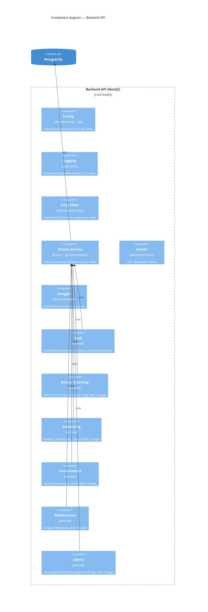

# C4 L3 — Component (Backend API)

Components inside the Backend API container. Foundation components exist now; feature modules
are planned and will move to "done" as the change that implements them lands.

