# C4 L3 — Component (Backend API)

Components inside the Backend API container. Foundation, `add-authentication`,
`add-doctor-availability`, `add-doctor-discovery`, `add-appointment-booking`, `add-notifications`,
and `add-consultations-and-records` components are done; the Admin Console is planned and will
move to "done" once that change lands.

```mermaid
C4Component
  title Component diagram — Backend API

  Container_Boundary(api, "Backend API (NestJS)") {
    Component(config, "Config", "@nestjs/config + zod", "Validates environment at boot; done")
    Component(logging, "Logging", "nestjs-pino", "Structured logs with request IDs, password/cookie redaction; done")
    Component(errors, "Error Filter", "Nest exception filter", "Consistent JSON error responses, with a stable machine-readable code for business-rule violations; done")
    Component(prisma, "Prisma Service", "Prisma + pg driver adapter", "Lazy-connecting database access; done")
    Component(health, "Health", "@nestjs/terminus", "GET /api/health; done")
    Component(swagger, "Swagger", "@nestjs/swagger", "OpenAPI document + UI; done")
    Component(auth, "Auth", "SessionAuthGuard, RolesGuard, argon2, rate limiting", "Accounts, sessions, sign-in/out, deny-by-default access control; done")
    Component(users, "Users", "Prisma model + admin provisioning script", "Accounts and their status; the pre-provisioned administrator; done")
    Component(patients, "Patients", "PatientsController/Service", "Self-service patient profile and completeness; done")
    Component(doctors, "Doctors", "DoctorsController/Service", "Self-service doctor profile and specializations; done")
    Component(specializations, "Specializations", "SpecializationsController/Service", "Public, read-only catalog; done")
    Component(discovery, "Doctor Discovery", "DiscoveryController/Service, NextSlotService", "Search, public profile, next-available-slot; done")
    Component(matching, "Doctor Matching", "SymptomsController/MatchingController/Service, matching-engine", "Symptom catalog and deterministic specialty matching; done")
    Component(availability, "Availability", "AvailabilityController/SlotsController/Service", "Weekly schedule, time off, slot calculation; done")
    Component(booking, "Booking", "AppointmentsController/Service, BookingRules", "Book, reschedule, cancel, list/detail; database exclusion constraints against double-booking; done")
    Component(consult, "Consultations", "ConsultationsController/Service, ClinicalAccessPolicy, transition", "Workspace, join/start/complete state machine; done")
    Component(records, "Records", "RecordsController/Service", "Notes, prescriptions, patient records; role-scoped by ClinicalAccessPolicy; done")
    Component(notifications, "Notifications", "NotificationsController/Service, ReminderService", "In-app, DB-backed notifications and reminders; done")
    Component(realtime, "Realtime Gateway", "socket.io (self-hosted)", "Session-authenticated live delivery, per-user/session rooms, consultation presence; done")
    Component(admin, "Admin Console", "planned", "User/doctor/appointment oversight, audit log; later change")
  }

  ContainerDb(db, "PostgreSQL")

  Rel(prisma, db, "SQL")
  Rel(auth, prisma, "uses")
  Rel(users, prisma, "uses")
  Rel(patients, prisma, "uses")
  Rel(doctors, prisma, "uses")
  Rel(specializations, prisma, "uses")
  Rel(patients, auth, "protected by")
  Rel(doctors, auth, "protected by")
  Rel(doctors, specializations, "references")
  Rel(discovery, prisma, "uses")
  Rel(discovery, auth, "protected by")
  Rel(discovery, availability, "reuses NextSlotService/generateSlots")
  Rel(matching, prisma, "uses")
  Rel(matching, auth, "protected by")
  Rel(matching, availability, "reuses NextSlotService for doctor ranking")
  Rel(matching, specializations, "references")
  Rel(availability, prisma, "uses")
  Rel(availability, auth, "protected by")
  Rel(booking, prisma, "uses")
  Rel(booking, auth, "protected by")
  Rel(booking, availability, "reuses generateSlots/booking-containment for exact-slot and schedule-protection checks")
  Rel(consult, prisma, "uses")
  Rel(consult, auth, "protected by")
  Rel(consult, booking, "reads/updates appointment status")
  Rel(consult, realtime, "joinRoom/emitToRoom for consultation:state, presence")
  Rel(records, prisma, "uses")
  Rel(records, auth, "protected by")
  Rel(records, consult, "shares ClinicalAccessPolicy, session lock")
  Rel(notifications, prisma, "uses")
  Rel(notifications, auth, "protected by")
  Rel(notifications, booking, "notified by, via withNotifications")
  Rel(consult, notifications, "notified by, via withNotifications")
  Rel(realtime, auth, "validates sessions via SessionService")
  Rel(realtime, consult, "consultation:subscribe checked via ClinicalAccessPolicy")
  Rel(notifications, realtime, "publishes after commit")
  Rel(admin, prisma, "uses")
```

See [Authentication & Authorization](/architecture/auth) for the Auth component's guard
pipeline, and [Data Model](/architecture/data-model) for the full schema.
