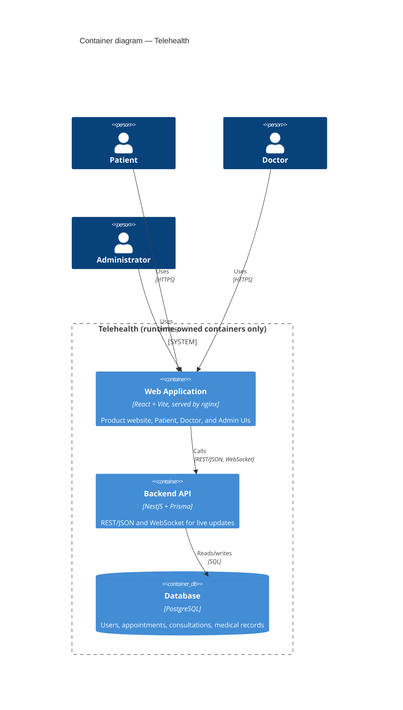

# C4 L2 — Container

This matches the brief's Figure 1: Web Application → REST/JSON → Backend API (NestJS + Prisma) →
PostgreSQL, all inside one runtime-owned boundary, plus the WebSocket edge nginx and the Vite dev
proxy forward to the self-hosted socket.io gateway (`add-notifications`) for live notification
delivery — see [Notifications & Real-time](/architecture/realtime) and
[C4 L3 — Component](/architecture/c4-component). No third-party system is shown or depended on.
