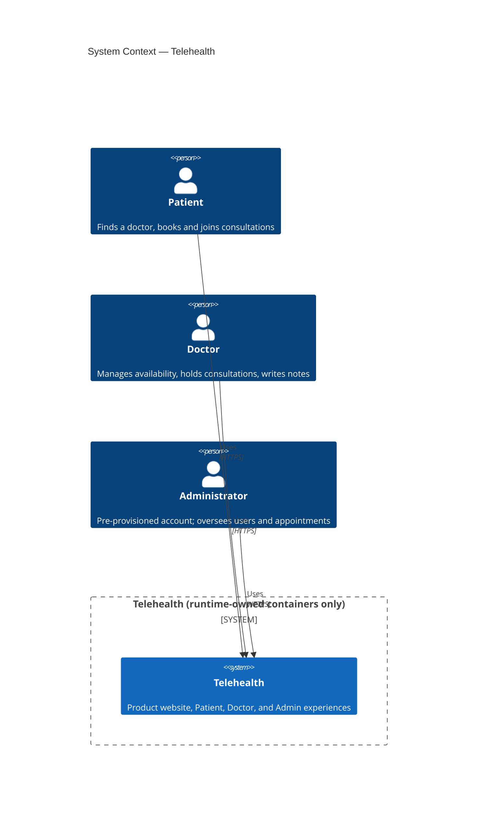

# C4 L1 — System Context

No third-party system appears in this diagram: authentication, doctor matching, notifications,
scheduling, consultations, and medical records are all implemented inside the Telehealth system
boundary itself (see [Deployment](/architecture/deployment) and `CLAUDE.md`'s standalone-runtime
rule).
