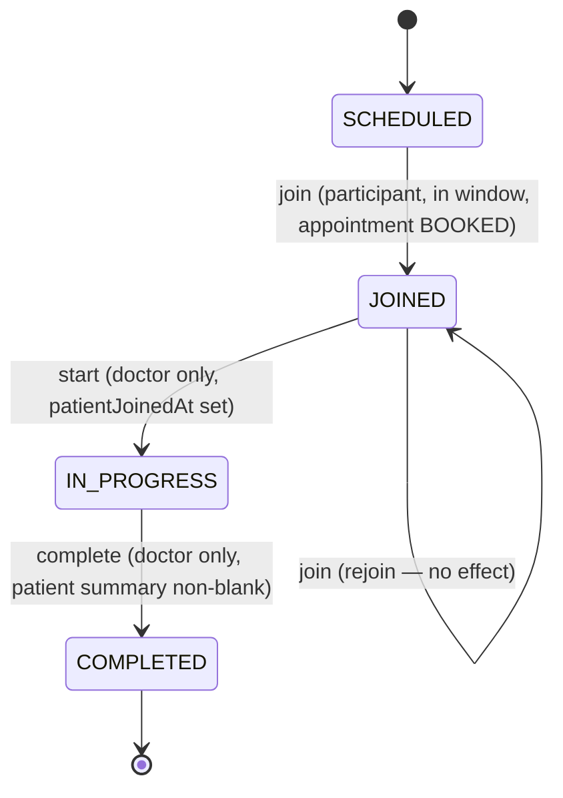

# Clinical Access

The consultation workspace, its state machine, and who may read or write consultation notes,
prescriptions, and patient records — `add-consultations-and-records`. Audio/video and external
conferencing are explicitly out of scope (see the brief); this is a first-party workspace that
tracks scheduled → joined → in-progress → completed state.

## Session model

One `consultation_sessions` row per appointment, created lazily on the first `join` — a missing
row means `SCHEDULED`, which is what lets this change avoid touching the booking code at all. All
of `join`/`start`/`complete` go through a single pure function, `transition` in
`apps/api/src/consultations/consultation-state.ts`, so every legal transition (and every rejection
code) lives in one place, unit-tested for every branch including the exact join-window edges.

| Action     | Guard                                                              | Rejection                    |
| ---------- | -------------------------------------------------------------------- | ------------------------------ |
| `join`     | Participant, appointment `BOOKED`, `now` in `[startsAt-15m, endsAt+30m]` | `409 OUTSIDE_JOIN_WINDOW` / `409 APPOINTMENT_NOT_ACTIVE` |
| `start`    | Doctor, session `JOINED`, `patientJoinedAt` set                     | `403` (patient) / `409 PATIENT_NOT_JOINED` / `409 INVALID_SESSION_TRANSITION` |
| `complete` | Doctor, session `IN_PROGRESS`, note has a non-blank patient summary | `403` (patient) / `409 SUMMARY_REQUIRED` / `409 INVALID_SESSION_TRANSITION` |

`complete` runs inside the same transaction as setting `appointment.status = COMPLETED` and
staging the patient's `CONSULTATION_SUMMARY_AVAILABLE` notification (see
[Notifications & Real-time](/architecture/realtime)) — all three commit together or not at all.
Every transition takes a `SELECT ... FOR UPDATE` lock on the session row first
(`apps/api/src/consultations/session-lock.ts`), shared with note/prescription writes, so a
concurrent completion can never race past an in-flight edit.

State changes and presence are pushed live over the existing realtime gateway; see
[Notifications & Real-time](/architecture/realtime#consultation-presence-add-consultations-and-records).

## `ClinicalAccessPolicy`

One module (`apps/api/src/consultations/clinical-access-policy.ts`) is the single place every
read or write of clinical data — workspace patient-summaries, notes, prescriptions, and patient
records — is decided, so "who can read what" is reviewable without hunting across controllers.

| Check                       | Rule                                                                 | Non-participant | Wrong state |
| ---------------------------- | ----------------------------------------------------------------------- | ------------------ | ------------- |
| `canViewWorkspace`           | Participant (patient or doctor on the appointment)                   | `404`               | `409 APPOINTMENT_NOT_ACTIVE` if cancelled |
| `canWriteRecord`              | The appointment's doctor, session `JOINED` or `IN_PROGRESS`           | `404`               | `409 RECORD_LOCKED` (completed) / `409 SESSION_NOT_ACTIVE` |
| `canPatientReadRecord`        | The appointment's own patient, session `COMPLETED`                    | `404`               | `404` (draft, not yet completed) |
| `hasTreatingRelationship`     | A `BOOKED` or `COMPLETED` appointment exists between doctor and patient (a `CANCELLED`-only history doesn't count) | `404`  | — |

**Administrators get `403`, not `404`, on every clinical route** — enforced by `@Roles(Role.PATIENT,
Role.DOCTOR)` on every controller in `apps/api/src/consultations` and `apps/api/src/records`
before any of the checks above run, matching the "No administrator access to clinical content"
requirement. Everyone else (a stranger, another patient, another doctor with no treating
relationship) gets `404`, so a request never reveals whether the appointment or record even
exists.

### Continuity of care: doctors can read each other's notes

`GET /patients/{patientId}/record` returns the patient's *completed consultations with any
doctor*, not just the requesting doctor's own — gated only by `hasTreatingRelationship` (the
requesting doctor needs their own `BOOKED` or `COMPLETED` appointment with that patient to see
the record at all, but the record itself isn't filtered to their own visits). This is a
deliberate product choice: a doctor picking up an existing patient can see what a colleague
already found, rather than starting from zero. The trade-off is that a patient's clinical history
is visible to every doctor who has ever treated them, not restricted per-episode; there is no
patient consent step to opt out of this, and access logging of clinical reads is noted as future
work (see design.md's Non-Goals).

### Prescription refill requests reuse this policy, not a new one

`add-prescription-refills` introduces no new access-control abstraction: requesting a refill is
gated by the exact same `canPatientReadRecord` check a record read already uses (if a patient can
read the record, they can request a refill on a prescription in it), and deciding one is gated by
the same `hasTreatingRelationship` check `GET /patients/{patientId}/record` uses — including its
"any doctor with a treating relationship to this patient/dependent pair may act on it" shape, not
a stricter "must be this exact appointment's doctor" rule. Listing a doctor's own queue is
narrower, filtering directly to appointments where that doctor is the appointment's own `doctorId`
— a doctor never sees another doctor's queue, even one they could technically decide.

## API surface

| Method | Path | Access |
| ------ | ---- | ------ |
| GET | `/consultations/{appointmentId}` | Participant (patient or doctor); admin `403` |
| POST | `/consultations/{appointmentId}/join` | Participant |
| POST | `/consultations/{appointmentId}/start` | Doctor |
| POST | `/consultations/{appointmentId}/complete` | Doctor |
| PUT | `/consultations/{appointmentId}/note` | Doctor, session writable |
| POST | `/consultations/{appointmentId}/prescriptions` | Doctor, session writable → `201`, capped at 20 |
| PATCH / DELETE | `/consultations/{appointmentId}/prescriptions/{id}` | Doctor, session writable |
| GET | `/records` | Patient (own, completed only) |
| GET | `/records/{appointmentId}` | Patient (own, completed only) |
| GET | `/patients/{patientId}/record` | Doctor (treating relationship) |
| POST | `/records/{appointmentId}/prescriptions/{prescriptionId}/refill-requests` | Patient (own, completed record) |
| GET | `/doctors/me/refill-requests` | Doctor (own appointments only) |
| POST | `/doctors/me/refill-requests/{id}/approve` \| `/deny` | Doctor (treating relationship) |

The workspace GET includes the patient's age/conditions/allergies/medications only when the
caller is the doctor, and the current note/prescriptions for the doctor always, or for the patient
only once the session is `COMPLETED` — see the "Workspace access" requirement.
