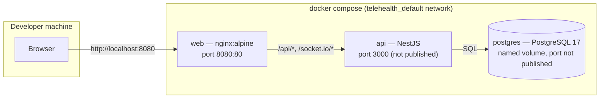

# Deployment

Local deployment is a single Docker Compose stack. `docker compose up --build` starts it with
working defaults and no `.env` file required; see the repository `README.md` for the exact
commands.

## Ports and volumes

| Service  | Container port | Host port           | Notes                                                             |
| -------- | -------------- | ------------------- | ----------------------------------------------------------------- |
| web      | 80             | `${WEB_PORT:-8080}` | Serves the SPA, proxies `/api` and `/socket.io`                   |
| api      | 3000           | not published       | Reached only through `web`'s proxy                                |
| postgres | 5432           | not published       | Reached only by `api`; dev-only compose file publishes it on 5432 |

## Startup order and health

`postgres` has a `pg_isready` healthcheck. `api` starts once postgres is healthy, runs
`prisma migrate deploy`, then starts the server; it becomes healthy once `GET /api/health`
returns `200`. `web` starts once `api` is healthy. Data persists in the named
`telehealth_pg_data` volume across `docker compose down` (without `-v`).

## Local development database

`docker-compose.dev.yml` runs PostgreSQL alone, published on `5432`, with a second
`telehealth_test` database (created by an init script) for e2e tests — so `apps/api` and
`apps/web` can run natively on the host (`pnpm dev`) against a real database without the full
container stack.
