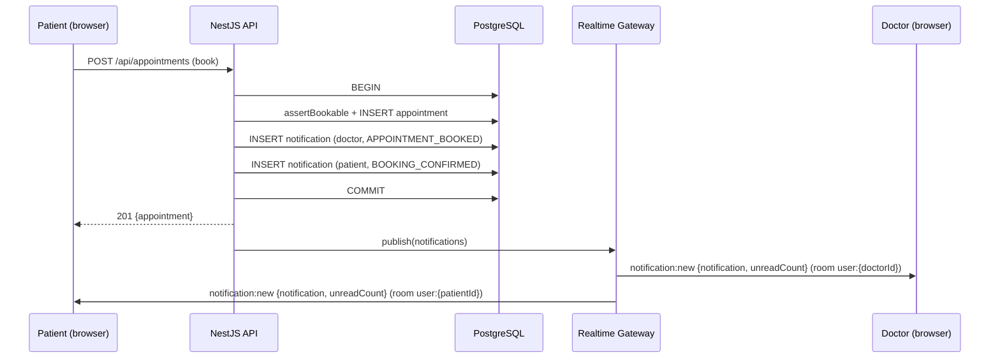

# Notifications & Real-time

Database-backed in-app notifications for appointment events, upcoming-appointment reminders, and
consultation completion, plus consultation-workspace presence — all delivered live over one
self-hosted socket.io gateway (`add-notifications`, `add-consultations-and-records`). No external
notification/push/email/SMS service is used anywhere in this path.

## Notification model

One row per recipient, written by `NotificationsService.stage` inside the same transaction as the
event that caused it, and only published over the socket after that transaction commits:

If the transaction throws (a business-rule rejection, a race lost to another booking, ...),
nothing is published and no notification row survives — publishing is only ever reached after
`$transaction` resolves. `withNotifications(prisma, notificationsService, fn)` is the shared
helper `AppointmentsService.book/reschedule/cancel` use for this; see
`apps/api/src/notifications/with-notifications.ts`.

Reminders (24h and 1h before a `BOOKED` appointment's start) come from `ReminderService.run(now)`,
on a `@nestjs/schedule` `@Cron('*/1 * * * *')` when `REMINDERS_ENABLED` is on (it's off in tests,
CI, and OpenAPI generation, so no timer keeps those processes alive). A unique `dedupeKey`
(`reminder:{24h|1h}:{appointmentId}:{userId}`) makes re-running the cron idempotent.

`ConsultationsService.complete` follows the same transactional-write/post-commit-publish shape:
inside the transaction that moves the session to `COMPLETED` and sets `appointment.status =
COMPLETED`, it stages one `CONSULTATION_SUMMARY_AVAILABLE` notification for the patient (never the
doctor), linking to `/patient/records/{appointmentId}` — see
[Clinical Access](/architecture/clinical-access).

## The realtime gateway

`RealtimeGateway` is a plain socket.io `Server` (`@nestjs/websockets` + `@nestjs/platform-socket.io`'s
`IoAdapter`) attached to the same NestJS HTTP server, at `path: '/socket.io'` — outside the `/api`
prefix, which nginx and the Vite dev proxy already forward with the WebSocket upgrade (see
[Deployment](/architecture/deployment)).

**Handshake**, run for every connection before it joins any room:

1. Parse the `th_session` cookie from the raw `Cookie` handshake header (the socket.io handshake
   never goes through Express's `cookie-parser`).
2. Check the `Origin` header against `APP_ORIGINS`, when present.
3. Validate the session through `SessionService.validateSession` — the exact same method
   `SessionAuthGuard` uses for HTTP requests, including the account-status check.
4. On any failure, `socket.disconnect(true)` before the socket joins anything.

On success the socket joins two rooms: `user:{userId}` (where events fan out) and
`session:{sessionId}` (so one revoked session's sockets can be disconnected without touching the
same user's other, still-valid sessions/devices). The socket re-validates its session every 5
minutes and disconnects itself if it's no longer valid, covering natural expiry between requests.

**Revocation.** `SessionService.revokeSession` / `revokeAllSessions` / `revokeAllSessionsExcept`
all call `disconnectSessions(sessionIds)` after revoking in the database — covering logout,
logout-all, password change (which revokes every other session), and an administrator suspending
or deactivating an account (`add-admin-console`, called right after its own transaction commits —
see [Admin](/modules/admin#user-management)). `SessionService` depends on this through a
`SESSION_REALTIME_NOTIFIER` token/interface rather than importing `RealtimeGateway` directly: the
two modules depend on each other (`AuthModule` ⇄ `RealtimeModule`, both behind `forwardRef`), and a
class used directly as a constructor parameter's type in that cycle throws
`Cannot access '<Class>' before initialization` the moment either file evaluates first, even
behind `forwardRef` — see `apps/api/src/auth/session/session-realtime-notifier.ts`.

**Events:**

| Event                | Payload                                | When |
| --------------------- | --------------------------------------- | ---- |
| `notification:new`    | `{ notification, unreadCount }`         | After an event's transaction commits, to each recipient's `user:{id}` room |
| `notifications:count` | `{ unreadCount }`                       | After mark-read / mark-all-read, so every open tab stays in sync |

There is a single API instance and no Redis adapter — acceptable at this scale (see design.md's
"Risks / Trade-offs"). `RealtimeGateway` also exposes `joinRoom`/`emitToRoom` helpers, used by
`ConsultationsService` to push consultation state onto the same connection (see
[Clinical Access](/architecture/clinical-access) for the consultation workspace itself).

### Consultation presence (`add-consultations-and-records`)

Two incoming `@SubscribeMessage` handlers, refused unless the socket has already finished
authenticating (`socket.data.userId` set — `handleConnection`'s `authenticate()` is async, so a
message can arrive before it resolves) and `ClinicalAccessPolicy.canViewWorkspace` allows this
user onto that appointment:

| Event (client → server)   | Payload               | Ack                                         |
| --------------------------- | ---------------------- | --------------------------------------------- |
| `consultation:subscribe`    | `{ appointmentId }`    | `{ ok, presence? }` — joins `appointment:{id}` on success |
| `consultation:unsubscribe`  | `{ appointmentId }`    | `{ ok }` — leaves the room |

Presence (who currently has the workspace open) is tracked in memory, keyed by appointment, as a
`userId -> open-socket-count` map cached with the appointment's `patientId`/`doctorId` at
subscribe time — so leaving (unsubscribe or disconnect) never needs its own DB round trip, which
keeps `handleDisconnect` synchronous.

| Event (server → client) | Payload                                       | When |
| -------------------------- | ------------------------------------------------ | ---- |
| `consultation:state`       | The session's current state + timestamps         | After `join`/`start`/`complete` commits, to `appointment:{id}` |
| `consultation:presence`    | `{ patientPresent, doctorPresent }`               | On subscribe, unsubscribe, and disconnect |

The web client emitting `consultation:subscribe` right after opening the socket — without waiting
for its own `connect` event — can still race `authenticate()`; a real client retries on `{ok:
false}` (see `apps/web/src/lib/consultations/use-consultation-socket.ts`'s
`subscribeWithRetry`) rather than treating it as an error.

## Web

`RealtimeProvider` (mounted once, inside `RoleAreaLayout`, so every role gets it) opens a single
`socket.io-client` connection with `withCredentials: true` and no explicit URL (same-origin, like
every other API call). On `notification:new` it updates the unread-count query's cached data,
invalidates the notifications list and appointment queries, and shows a toast; on
`notifications:count` it just updates the count.

The unread-count query (`useUnreadCount`) sets `refetchInterval: 60_000` only while
`useRealtimeConnected()` is false — the fallback the "Fallback without a live connection" scenario
requires. The `NotificationBell` in every role header shows the badge and a dropdown of the 10
most recent notifications with "mark all as read"; opening one marks it read and navigates to its
(already role-relative) `link`. Each role area also has a `/{role}/notifications` page with an
unread filter and pagination.

`RealtimeProvider` also exposes the raw socket itself (`useRealtimeSocket`), not just
`connected` — the consultation workspace's `useConsultationPresence` reuses this one connection
to subscribe/unsubscribe and listen for `consultation:state`/`consultation:presence`, rather than
opening a second socket.io connection per page.

## Reading API

| Method | Path                        | Access        |
| ------ | ---------------------------- | ------------- |
| GET    | `/notifications`             | signed in (own) |
| GET    | `/notifications/unread-count`| signed in (own) |
| POST   | `/notifications/{id}/read`   | signed in (own) → 200 / 404 |
| POST   | `/notifications/read-all`    | signed in (own) → 204 |

Every query and mutation is scoped to `request.user.id`; there's no way to read or change another
user's notifications (`404`, not `403`, for someone else's notification ID — the standard
"don't confirm it exists" pattern used elsewhere in this API).
