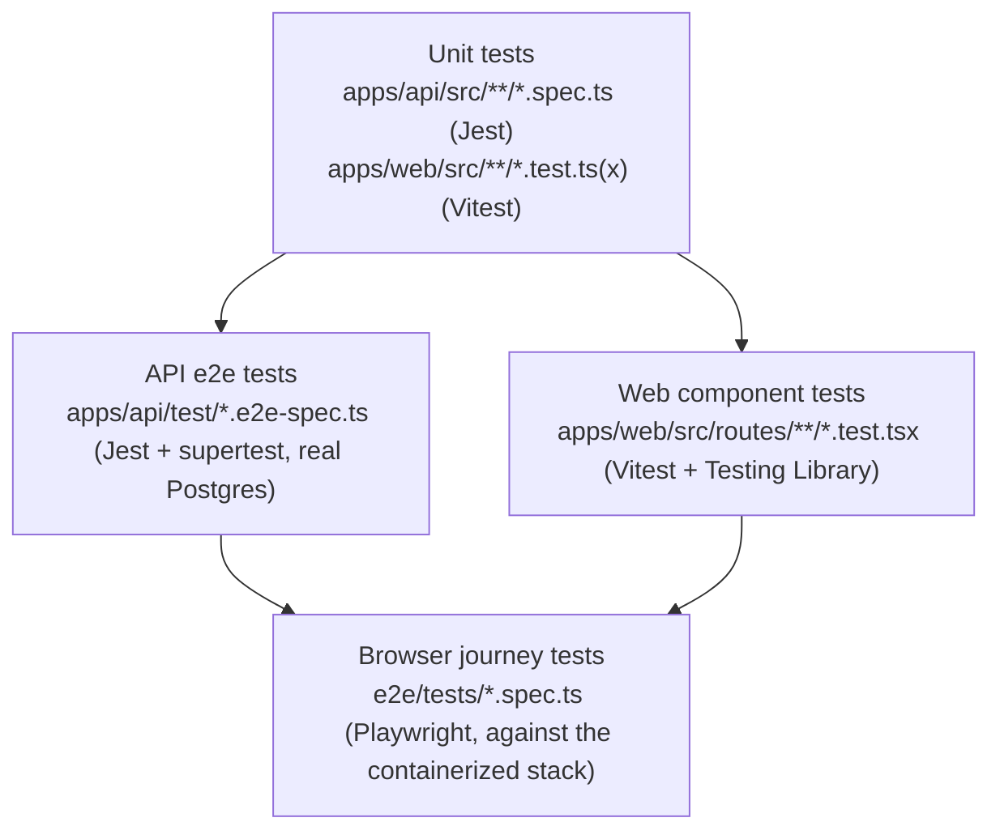

# Testing & Quality

Every requirement in `openspec/specs/` is written as `#### Scenario:` blocks, and every scenario
is meant to map to a test named after it. This page describes the test pyramid, how that mapping
is enforced, and the handful of test-harness shortcuts worth knowing about when reading the suite.

## Test pyramid



- **Unit tests** exercise pure logic in isolation — domain rules (`booking-rules.spec.ts`,
  `slot-generator.spec.ts`), pure notification-draft builders, the traceability check's own
  matching logic (`scripts/check-traceability.test.mjs`, run with Node's built-in test runner).
  Fastest, most numerous, run with no external services.
- **API e2e tests** exercise the real NestJS app (via `Test.createTestingModule`) against a real
  PostgreSQL database (`telehealth_test`), through HTTP with `supertest` — this is where role
  boundaries, transactions, notifications, realtime sockets, and the database's own exclusion
  constraints are actually proven, not mocked.
- **Web component tests** render individual routes/components with React Testing Library, mocking
  the data hooks (`vi.mock('@/lib/.../use-*')`) rather than a running API — fast feedback on a
  single page's states (loading/empty/error/data, form validation, navigation).
- **Browser journey tests** (`e2e/`, Playwright) are the only layer that runs against the actual
  built Docker images — nginx, the Content-Security-Policy, the container entrypoints, and real
  cross-service network calls — rather than an in-process test double. They're slow and few by
  design (one full core-journey test, plus a handful of cross-cutting checks), matching the
  pyramid's shape.

## Scenario-to-test convention

A test's name should contain the exact title of the scenario it proves, e.g. a spec's
`#### Scenario: Signed-out denied` scenario pairs with `it('Signed-out denied', ...)` in whichever
test file exercises it. When the same scenario title is reused across capabilities (or, rarely,
twice within one capability), each occurrence gets its own test, distinguished with a parenthesized
qualifier your test file's context already makes unambiguous — e.g. `'Signed-out denied
(appointments)'`, `'Signed-out denied (availability)'`. The qualifier doesn't need to spell out the
capability's exact slug; it just needs to make the test title, read on its own, distinguishable
from the same scenario in another file.

## The traceability check

`scripts/check-traceability.mjs` (run via `pnpm traceability`, and wired into CI after the unit
tests) enforces the convention above mechanically:

1. Parses every `#### Scenario: <title>` out of `openspec/specs/<capability>/spec.md`.
2. Scans `it(`/`test(`/`describe(` string-literal titles under `apps/api/src`, `apps/api/test`,
   `apps/web/src`, and `e2e/`.
3. Computes a maximum bipartite matching between scenario occurrences and test titles that contain
   them (case-insensitive substring) — so a test title can satisfy at most one scenario occurrence,
   which is what makes the qualifier rule above actually get checked, rather than one broadly-named
   test silently "covering" several scenarios it never really asserts.
4. Anything left unmatched is checked against `openspec/manual-verification.md`'s register (one
   register row consumes one leftover occurrence of that exact capability+title pair).
5. Whatever's still missing is printed grouped by capability, and the script exits non-zero.

Run it locally with `pnpm traceability`; its own matching logic is unit-tested in
`scripts/check-traceability.test.mjs` (`node --test scripts/check-traceability.test.mjs`, or
`pnpm test:scripts` to run every root-level script test).

## The manual-verification register

`openspec/manual-verification.md` is a short, deliberately hard-to-grow list: a scenario only
belongs there when automating it genuinely isn't reasonable, with a note on how it actually was
verified and why. In practice that's mostly infrastructure-lifecycle scenarios — a fresh
`docker compose up --build` in an empty environment, a container restart preserving a named
volume, a real GitHub Pages deployment — that describe Docker/CI/hosting behavior rather than
application behavior a unit, API, or browser test can exercise without disproportionate
infrastructure of its own. Preferring a renamed or added test over a register entry is the rule;
each entry documents why that wasn't reasonable for that specific scenario.

## Test-harness shortcuts

A few tests deliberately bypass part of the real flow to make an otherwise time-dependent or
account-heavy scenario practical to set up. Each is called out in a comment at its use site; the
notable ones:

- **API e2e tests** insert appointments directly via Prisma (`test/support/appointment-helpers.ts`'s
  `createAppointmentDirect`/`completeAppointmentDirect`) to land a fixture appointment inside a
  time window (the booking lead time, the consultation join window, "already ended") that the real
  booking flow's own rules would otherwise make impossible to construct quickly. The booking and
  reschedule *rules themselves* are still exercised end-to-end elsewhere (`appointments-book.e2e-spec.ts`,
  `appointments-reschedule.e2e-spec.ts`); this shortcut is only used for tests whose subject is
  something *downstream* of a booked appointment already existing (consultations, records, admin
  oversight).
- **The browser journey test** uses the same idea once, at the very end of its flow: after booking
  and rescheduling a real appointment through the UI, it uses a small DB helper (`e2e/fixtures/db.ts`)
  to move that appointment's `starts_at`/`ends_at` into the consultation join window, rather than
  waiting in real time for a slot minutes or hours out. Everything before that point — registration,
  approval, search, booking, rescheduling — goes through the real UI and real API rules first.
- **The demo dataset** (`apps/api/scripts/seed-demo.ts`) inserts past ("completed") appointments
  directly with their final status, since the booking API's own rules only allow booking into the
  future. Upcoming appointments it creates are still chosen from the same `generateSlots` function
  the booking API uses, so they're valid, non-overlapping, real bookable times — see
  [Demo guide](/guide/demo) and the `demo-data` capability spec for the full contract.
- **`test/support/reset-db.ts`**'s `resetDatabase()` uses `TRUNCATE ... CASCADE` between e2e spec
  files, which is also the one operation allowed to bypass the audit log's append-only trigger
  (real requests can only `INSERT` into `audit_logs`; only this test helper truncates it, resetting
  every table to empty between files so tests don't depend on run order).

## Running the suites

See the repository `README.md` for the full command reference. The short version:

```bash
pnpm test              # unit tests, every package
pnpm test:e2e          # API e2e tests (builds api, migrates telehealth_test)
pnpm --filter web run test   # web component tests
pnpm test:scripts      # scripts/*.test.mjs (Node's built-in test runner)
pnpm traceability       # the traceability check, against the real specs
pnpm test:browser       # the Playwright suite, against a running e2e stack (see below)
```

The browser suite needs the containerized stack running with the e2e override, which publishes a
throwaway Postgres and disables demo data and rate limiting:

```bash
docker compose -f docker-compose.yml -f docker-compose.e2e.yml up --build -d
# wait for it to report healthy, then:
pnpm --filter e2e exec playwright test
docker compose -f docker-compose.yml -f docker-compose.e2e.yml down -v
```
