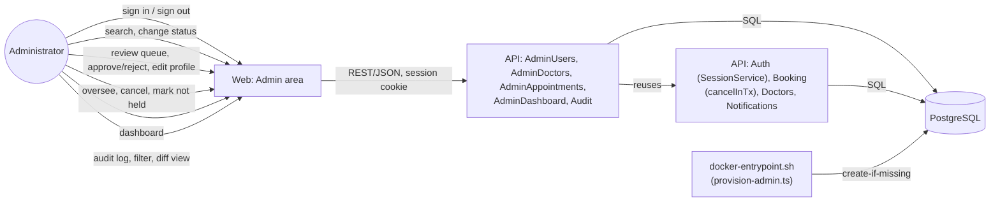

# Admin

> Pre-provisioned sign-in, user management (activate/suspend/deactivate with stored reasons),
> doctor profile review/approval, appointment oversight, an operational dashboard, and an
> append-only audit log of every privileged action are done (`add-authentication`,
> `add-admin-console`).

## Module Overview

There is no public admin registration: the administrator account is created from configuration
(`ADMIN_EMAIL`/`ADMIN_PASSWORD`) the first time the stack starts against an empty database, and is
never overwritten on restart — see [Deployment](/architecture/deployment). Admins share the same
underlying tables as Patient and Doctor (`users`, `appointments`, `consultation_sessions`) and
differ by permission scope, not by separate databases — every `/admin/...` route is
`@Roles(ADMIN)` and non-admins get `403`, enforced in NestJS guards, never only hidden in the UI
(see [Authentication & Authorization](/architecture/auth)). Admins can never read clinical
content: no admin endpoint returns a booking `reason`, symptoms, consultation notes, or
prescriptions, and a dedicated test (`no-clinical-content`, in
`test/admin-appointments.e2e-spec.ts`) asserts none of those keys ever appear in an admin
appointment payload.

Every admin mutation — a status change, a doctor decision, a profile edit, a cancellation, or
marking an appointment not held — writes exactly one [audit log](#audit-log) entry in the same
database transaction as the action, so the two can never exist independently of each other.

Admin navigation: **Dashboard**, **Users**, **Doctor reviews**, **Appointments**, **Audit log**,
plus the shared notification bell and `/admin/notifications` page (`add-notifications`).

## User management

`GET /admin/users` lists accounts — paginated, newest first — filtered by role, by status, and by
a case-insensitive text query against email or display name. Each result includes the account's
role, status and reason, creation and last-sign-in time, and its number of upcoming `BOOKED`
appointments (used by the deactivation warning below, so the web app never issues a second call
just to show a count).

`POST /admin/users/{id}/status` sets a patient or doctor account to `ACTIVE`, `SUSPENDED`, or
`DEACTIVATED`, with a required reason (5-500 characters). Administrator accounts can't be changed
through this endpoint (`403`, even for an admin's own account), and setting the status an account
already has is rejected (`409 STATUS_UNCHANGED`). `AdminUsersService.changeStatus` runs as one
transaction:

1. Lock and read the target user; reject an admin target or a no-op change.
2. Update `status`/`statusReason`.
3. If the new status is `DEACTIVATED`: cancel every upcoming `BOOKED` appointment of that account
   (either side — patient or doctor) through the same `AppointmentsService.cancelInTx` that patient
   and doctor self-cancellation use (see [Doctor](/modules/doctor#managing-bookings)), with reason
   `"Account deactivated: <admin's reason>"` and `kind: 'platform'`, which notifies every
   still-active counterpart ("Appointment cancelled ... cancelled by the platform") but never the
   just-deactivated account itself — its status is already non-`ACTIVE` in the same transaction by
   the time the notification rule checks it, so no separate "don't notify the actor" exception is
   needed.
4. Record the `USER_STATUS_CHANGED` audit entry, with the cancelled appointment IDs listed in
   `after` when there were any.

Right after the transaction commits, a `SUSPENDED`/`DEACTIVATED` status change calls
`SessionService.revokeAllSessions`, the same revoke path logout uses — which also disconnects that
account's open sockets — so the account is signed out immediately, not on its next request (see
[Authentication & Authorization](/architecture/auth#session-model)). Reactivating an account
doesn't restore appointments it lost to deactivation; they stay `CANCELLED`.

`/admin/users` in the web app is a URL-synced search/filter table; its status dialog requires a
reason and, before confirming a deactivation, states how many upcoming appointments will be
cancelled (from the list row's own count).

## Doctor profile review

`GET /admin/doctors?verification=PENDING` lists doctor profiles by verification status (default
`PENDING`), oldest waiting first — ordered by `doctor_profiles.updated_at`, which a re-review
resets, so a doctor who was just bumped back to `PENDING` (see below) goes to the back of the
queue, not the front. `GET /admin/doctors/{id}` returns the full profile, including email and
license number, which patients never see.

`POST /admin/doctors/{id}/approve` (optional note) and `.../reject` (required note, 5-1000
characters) accept only a decision that differs from the doctor's current status (`409
STATUS_UNCHANGED` otherwise), each running in one transaction: update
`verificationStatus`/`reviewNote`, notify the doctor (`PROFILE_APPROVED`/`PROFILE_REJECTED`, the
rejection's body carrying the note), and record `DOCTOR_APPROVED`/`DOCTOR_REJECTED`. Approval makes
the doctor immediately visible to patients (the same `visibleDoctorWhere` rule discovery and
booking use); rejection hides them. A rejected doctor's existing appointments are **not**
cancelled automatically — they surface as `DOCTOR_UNAVAILABLE` invalid bookings for an
administrator to resolve (see [below](#appointment-oversight)).

`PATCH /admin/doctors/{id}` edits a doctor's names, specializations, biography, years of
experience, license number, and consultation length under the exact same validation
`DoctorsService.updateOwnProfile` uses (duplicate-license check, specialization-catalog
membership, consultation length in `{15,20,30,45,60}`) but never touches verification status or
review note — approval/rejection is the only way to change those. The edit is audited as
`DOCTOR_PROFILE_UPDATED` with only the changed, allow-listed fields.

### Re-review on credential change

When an `APPROVED` doctor changes their own license number or their set of specializations (via
their own `PATCH /doctors/me/profile`, not an admin edit), `DoctorsService.updateOwnProfile` resets
`verificationStatus` to `PENDING` and clears `reviewNote` — see
`apps/api/src/doctors/doctor-re-review.ts`'s `requiresReReview`. The doctor is hidden from patients
again until an administrator reviews them, and their existing appointments are kept (flagged
`DOCTOR_UNAVAILABLE` for the oversight page in the meantime, same as a rejected doctor's). Any
other self-edit (bio, years of experience, consultation length, names) leaves `APPROVED` alone.

`/admin/doctors` in the web app has tabs for pending/approved/rejected;
`/admin/doctors/:doctorId` shows the full profile, the same profile form component the doctor's
own profile page uses (in "admin mode" — no verification fields), and approve/reject actions.

## Appointment oversight

`GET /admin/appointments` lists every appointment — paginated, filtered by status, consultation
state, start-date range, doctor, patient, and an `invalidOnly` toggle. Every field on the response
comes from an explicit allow-list (times, both participants' `{id, displayName}`, status,
consultation state, invalid-booking flags, cancellation/resolution metadata) — `reason`,
`symptoms`, consultation notes, and prescriptions are never fetched for this path at all, not just
omitted from the DTO, so there's nothing to leak even by accident.

### Invalid-booking flags

Computed at query time, not stored (no job keeps a stored flag correct), by
`apps/api/src/admin-appointments/invalid-booking.ts` — one module with both a pure predicate
(unit-tested, and reused for each appointment's in-memory `flags[]`) and a matching Prisma `where`
builder (reused by the `invalidOnly` filter and the dashboard's invalid-bookings count, so the
three can't drift):

- **`NOT_COMPLETED`** — `status = BOOKED` and it ended more than 30 minutes ago without being
  completed.
- **`DOCTOR_UNAVAILABLE`** — `status = BOOKED`, it hasn't started yet, and its doctor is no longer
  visible to patients (not `APPROVED`, or the doctor's account isn't `ACTIVE`).

`POST /admin/appointments/{id}/cancel` cancels any `BOOKED` appointment that hasn't ended yet (a
required reason, 5-500 characters; `409 APPOINTMENT_NOT_CANCELLABLE` once it has), through the
same `AppointmentsService.cancelInTx` deactivation uses (`kind: 'platform'`) — both participants
who are still active are notified that the platform cancelled it, with the reason. `POST
.../mark-not-held` resolves a `NOT_COMPLETED` appointment to status `NOT_HELD` with a required
reason stored in `resolution_reason` (kept separate from `cancellation_reason` — the appointment
was never cancelled); attempting it on anything else is `409 NOT_ELIGIBLE_FOR_NOT_HELD`. `NOT_HELD`
appointments appear in both participants' own past-appointment lists with that status, same as any
other non-`BOOKED` row. Both actions are audited
(`APPOINTMENT_CANCELLED`/`APPOINTMENT_MARKED_NOT_HELD`).

`/admin/appointments` in the web app is a filters table with status/consultation-state/flag
badges and cancel/mark-not-held actions (each behind a required-reason dialog); the dashboard's
"invalid bookings" tile deep-links here with `invalidOnly=true`.

## Operational dashboard

`GET /admin/dashboard?tz=<IANA zone>` (default `UTC`, validated the same way the availability
schedule's time zone is — `apps/api/src/common/timezone.ts`) computes, per request, with no
caching: patients and doctors by account status, doctors by verification status, appointments by
status for today/upcoming/all time, consultations in progress and completed today/in the last 7
days, the pending-review count, the invalid-booking count (the same query-builder module above),
and a 29-bucket daily trend (14 days back, today, 14 days forward) of `BOOKED`/`COMPLETED`
appointments starting each day.

The trend buckets a start time by its **local calendar date** in the requested time zone — the
same `localCalendarDate` resolution `generateSlots` uses (see
[Doctor](/modules/doctor#slot-algorithm)) — not its UTC date, so e.g. an appointment at 23:30 UTC
falls in the *next* day's bucket for an admin viewing in `Asia/Manila` (UTC+8). This is a pure
function (`apps/api/src/admin-dashboard/dashboard-buckets.ts`, unit-tested against fixed dates),
not a raw SQL `date_trunc(... AT TIME ZONE ...)` query, for the same testability reasons
`generateSlots` itself is pure.

`/admin` in the web app shows stat tiles (the pending-reviews and invalid-bookings tiles link to
their filtered work-queue pages) and a dependency-free inline-SVG bar chart of the trend, using
the browser's own time zone, today marked — each bar carries a native `<title>` tooltip, and the
same series is also rendered as a visually hidden `<table>` for assistive tech that doesn't expose
SVG tooltips. No chart library.

## Audit log

Every administrator action in this module, plus administrator sign-in, writes exactly one
`audit_logs` row through `AuditService.record(tx, entry)` — the *only* way to write one, and it
takes a `Prisma.TransactionClient`, not the general-purpose `PrismaService`, so calling it outside
a transaction the caller already owns is a compile error, not a runtime bug. That's what makes the
guarantee absolute: the entry and the action it describes always commit or roll back together (an
e2e "atomicity" test in `test/admin-users.e2e-spec.ts` forces a rollback after the audit write and
confirms neither persists), and a rejected action (missing reason, `STATUS_UNCHANGED`, and so on)
never gets an entry at all, because the write it would have described never happened either.

Each entry records the acting administrator, the action, the affected record's type and ID, the
reason (if any), the changed fields' values before and after, the request ID, the client IP, and
the timestamp. `before`/`after` are built by `diffFields(before, after, allowList)`
(`apps/api/src/audit/diff-fields.ts`): it reads *only* the fields named in a hand-written
allow-list per action (e.g. `status`/`statusReason` for a status change;
`firstName`/`lastName`/`bio`/`yearsOfExperience`/`licenseNumber`/`consultationMinutes`/
`specializationIds` for a profile edit) and includes only the ones that actually changed — a
password hash, a session token, or a clinical field is never in any allow-list, so it's
structurally impossible for one to reach the log even if a caller passed the full row by mistake.
`requestId`/`ip`/`userAgent` come from a request-scoped `AsyncLocalStorage` context
(`apps/api/src/common/middleware/request-context.ts`, populated by a small Express middleware
registered after the existing request-ID and client-IP middleware), not from parameters, so a
caller can't forget — or fake — them.

### Immutability

The `add_audit_log` migration adds a trigger, not just an absence of update/delete routes:

```sql
CREATE FUNCTION audit_logs_immutable() RETURNS trigger AS $$
BEGIN RAISE EXCEPTION 'audit_logs is append-only'; END; $$ LANGUAGE plpgsql;
CREATE TRIGGER audit_logs_no_update_delete BEFORE UPDATE OR DELETE ON audit_logs
  FOR EACH ROW EXECUTE FUNCTION audit_logs_immutable();
```

A raw `UPDATE`/`DELETE` against `audit_logs` fails at the database, independent of the API
(`test/audit-log.e2e-spec.ts`'s "Database blocks changes"). `/admin/audit` only ever declares
`GET` routes, so a `PATCH`/`PUT`/`DELETE` to any audit path doesn't match a route at all and falls
through to the framework's ordinary 404 — there's no handler to guard in the first place.
`TRUNCATE` is not a row-level event and isn't blocked by this trigger; only the e2e test suite's
database-reset helper truncates, and the application itself never does.

`GET /admin/audit` lists entries — newest first, paginated — filtered by action, by acting
administrator, by affected record type and ID, and by date range; `GET /admin/audit/{id}` returns
one entry's full before/after values. `/admin/audit` in the web app is a filters table whose row
opens a diff view (changed fields, old value next to new); the users, doctor-review, and
appointment-oversight pages each link to "View audit history" for the record being viewed,
pre-filtered to that record's `entityType`/`entityId`.

## L2 Container View

Reuses the [C4 L2 Container](/architecture/c4-container) diagram's `web` and `api` containers — no
new container is introduced. The flows this slice adds:



## Permission matrix

Every route below requires a signed-in `ADMIN`; a signed-in `PATIENT`/`DOCTOR` gets `403`, and a
signed-out caller gets `401` (deny-by-default — see
[Authentication & Authorization](/architecture/auth#request-pipeline)). None of them are reachable
by any other role, and none of them ever return clinical content.

| Endpoint                                   | Effect                                              |
| ------------------------------------------- | ---------------------------------------------------- |
| `GET /admin/users`                         | Search/filter accounts                              |
| `POST /admin/users/{id}/status`            | Activate/suspend/deactivate (never an admin account) |
| `GET /admin/doctors`                       | Review queue by verification status                 |
| `GET /admin/doctors/{id}`                  | Full profile, including email and license           |
| `PATCH /admin/doctors/{id}`                | Edit profile (never verification status)             |
| `POST /admin/doctors/{id}/approve`         | Approve (optional note)                              |
| `POST /admin/doctors/{id}/reject`          | Reject (required note)                               |
| `GET /admin/appointments`                  | List/filter, with invalid-booking flags              |
| `GET /admin/appointments/{id}`             | One appointment's oversight details                  |
| `POST /admin/appointments/{id}/cancel`     | Cancel (required reason)                              |
| `POST /admin/appointments/{id}/mark-not-held` | Resolve a stale, uncompleted appointment           |
| `GET /admin/dashboard`                     | Operational counts and the 29-day trend               |
| `GET /admin/audit`                         | List audit entries, filtered                          |
| `GET /admin/audit/{id}`                    | One entry's before/after values                       |

## Data Model

Beyond the shared `users` table (role `ADMIN`, status, no separate profile), this module adds
`audit_logs` and the `NOT_HELD` status / `resolution_reason` column on `appointments` — see the
[Data Model](/architecture/data-model) page for the full current schema.
