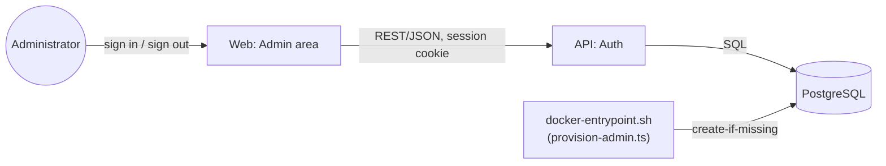

# Admin

> Pre-provisioned sign-in is done (`add-authentication`). User management (activate/suspend/
> deactivate with stored reasons), doctor profile review/approval, appointment oversight, an
> operational dashboard, and an audit log of admin actions are planned for a later change
> (`add-admin-console`).

## Module Overview

There is no public admin registration: the administrator account is created from configuration
(`ADMIN_EMAIL`/`ADMIN_PASSWORD`) the first time the stack starts against an empty database, and
is never overwritten on restart — see [Deployment](/architecture/deployment). Once signed in, an
administrator reaches a placeholder home page in its own area (navigation, initials avatar,
sign-out). Admins share the same underlying tables as Patient and Doctor (`users`, and later
`appointments`, `consultations`) and differ by permission scope, not by separate databases —
role-based access control is enforced in NestJS, not just hidden in the UI (see
[Authentication & Authorization](/architecture/auth)).

## L2 Container View

Reuses the [C4 L2 Container](/architecture/c4-container) diagram's `web` and `api` containers —
no new container is introduced. The flow this slice adds:

## Data Model

Planned beyond the shared `users` table (role `ADMIN`, status, no separate profile) — see the
[Data Model](/architecture/data-model) page for the full current schema. User
suspend/deactivate reasons, doctor review notes (already on `doctor_profiles`, written only by a
later admin-console change), and the audit log table arrive with `add-admin-console`.
