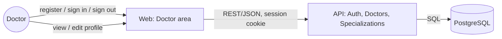
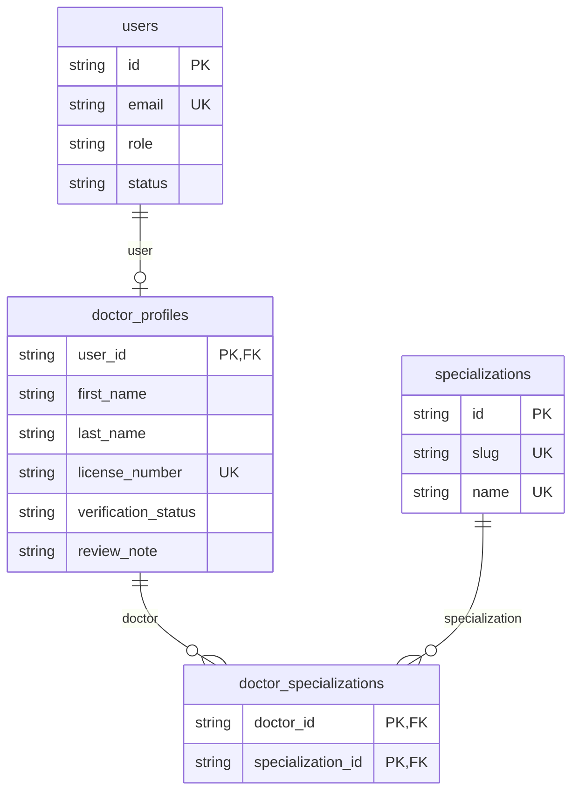

# Doctor

> Accounts, sign-in/out, and profile are done (`add-authentication`). Role-scoped patient
> records, availability/schedule management, in-app notifications, and consultation
> notes/prescriptions authoring are planned for later changes.

## Module Overview

A visitor registers as a doctor with an email, password, name, at least one specialization from
the catalog, and a license number; the account is signed in immediately, and the profile starts
in verification status `PENDING` (approval itself arrives in a later admin-console change). The
doctor area shows a notice while the profile is `PENDING` or `REJECTED` (with the administrator's
review note, once rejected) explaining that it isn't yet visible to patients. Doctors view and
edit their own profile — name, specializations, biography, years of experience, license number,
and consultation length — but cannot change their own verification status.

## L2 Container View

Reuses the [C4 L2 Container](/architecture/c4-container) diagram's `web` and `api` containers —
no new container is introduced. The flows this slice adds:

## Data Model

The doctor-owned slice of the full [Data Model](/architecture/data-model):

See [Authentication & Authorization](/architecture/auth) for the account/session model this all
sits behind.
