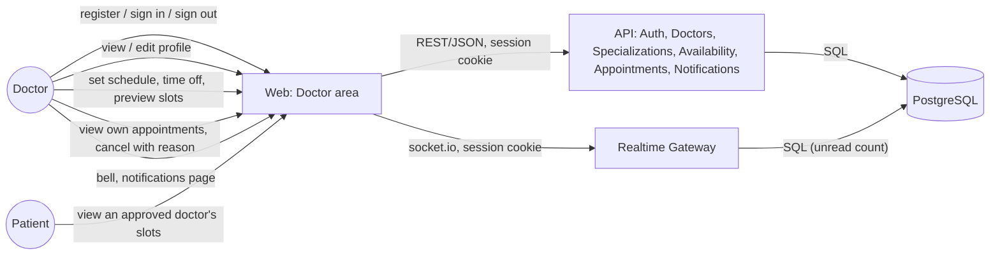
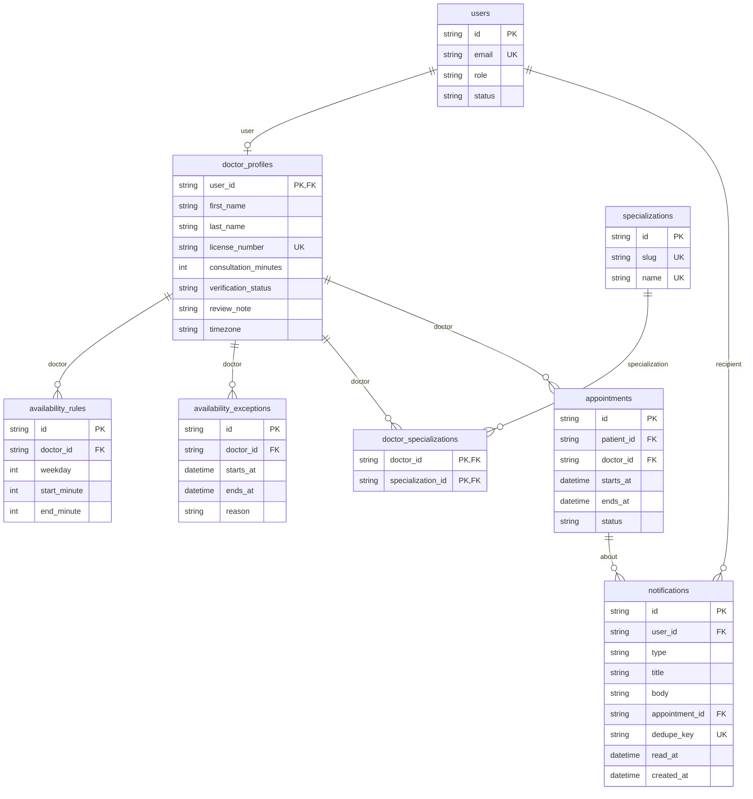

# Doctor

> Accounts, sign-in/out, profile, availability/schedule management, booking oversight (own
> appointments, cancellation, schedule protection against existing bookings), and in-app
> notifications are done (`add-authentication`, `add-doctor-availability`,
> `add-appointment-booking`, `add-notifications`). Role-scoped patient records and consultation
> notes/prescriptions authoring are planned for later changes.

## Module Overview

A visitor registers as a doctor with an email, password, name, at least one specialization from
the catalog, and a license number; the account is signed in immediately, and the profile starts
in verification status `PENDING` (approval itself arrives in a later admin-console change). The
doctor area shows a notice while the profile is `PENDING` or `REJECTED` (with the administrator's
review note, once rejected) explaining that it isn't yet visible to patients. Doctors view and
edit their own profile — name, specializations, biography, years of experience, license number,
and consultation length — but cannot change their own verification status.

### Availability

Doctors declare when they work as a weekly schedule in their own time zone — one or more
non-overlapping working ranges per weekday — plus time off (specific date-time ranges with no
slots). The API turns that, plus the profile's consultation length, into concrete bookable slots
on every read; nothing about slots is stored, so a schedule or consultation-length change takes
effect on the very next request. A doctor can manage and preview their own schedule while still
`PENDING`; everyone else only sees slots for `APPROVED` doctors (a pending/rejected doctor's slots
404 the same way a non-existent doctor ID would, so existence isn't revealed).

The `/doctor/schedule` page has a time-zone selector (defaulting to the browser's time zone before
the first save), a weekly range editor with inline validation, a time-off list, and a preview of
the doctor's own slots for the next seven days.

## Managing bookings

`/doctor/appointments` lists the doctor's own appointments in **Upcoming**/**Past** tabs, each
card showing the patient's name, age, reason, and any symptoms carried over from guided matching —
never the patient's full medical history, which stays out of scope until
`add-consultations-and-records`. The doctor home page's **Today** card lists the day's
appointments (by the doctor's own local date) in start order.

A doctor cancels their own upcoming `BOOKED` appointment with a required reason (5-500
characters); `POST /appointments/{id}/cancel` returns `400` if it's missing or too short. See
[Patient](/modules/patient#booking-an-appointment) for the shared booking rules, error codes, and
the database-level double-booking guarantee — the doctor side of booking is that same
`AppointmentsController`/`AppointmentsService`, scoped to the caller's own role.

### Schedule protection

Saving a weekly schedule or adding time off is rejected with `409` and code
`SCHEDULE_CONFLICTS_WITH_BOOKINGS` when it would leave an upcoming `BOOKED` appointment no longer
covered by any working range (schedule) or would overlap one (time off) — the rejection body lists
the affected appointments (`id`, `startsAt`, `endsAt`, patient name), which the schedule and
time-off forms render as a list linking to each appointment's detail. This is deliberate: a doctor
can't silently orphan a patient's booking by editing their hours; they cancel it first. See the
[Slot Algorithm](#slot-algorithm) below for how the containment check reuses the same local-time
resolution as slot generation (`isBookingContained` in
`apps/api/src/availability/booking-containment.ts`), including across a daylight-saving change.

## Notifications

A new booking, a reschedule, or a patient cancelling notifies the doctor ("New booking",
"Appointment rescheduled", "Appointment cancelled"), plus 24h/1h reminders before every `BOOKED`
appointment — delivered live while signed in, and always visible in the notification bell and
`/doctor/notifications`. See [Notifications & Real-time](/architecture/realtime) for the event →
transaction → commit → delivery model and the socket.io gateway.

## L2 Container View

Reuses the [C4 L2 Container](/architecture/c4-container) diagram's `web` and `api` containers —
no new container is introduced. The flows this slice adds:

## Data Model

The doctor-owned slice of the full [Data Model](/architecture/data-model):

`availability_rules.weekday` is ISO (Monday = 1 … Sunday = 7); `start_minute`/`end_minute` are
minutes since local midnight (0-1440, steps of 15), interpreted in `doctor_profiles.timezone`.
`availability_exceptions` (time off) stores `starts_at`/`ends_at` as UTC instants directly — the
web app converts the doctor's local input to and from UTC using their chosen time zone.

## Slot Algorithm

`GET /doctors/{doctorId}/slots?from&to` (and the doctor's own `PUT`/`GET
/doctors/me/availability`) are backed by a pure function, `generateSlots`, that takes no clock and
does no I/O — `now` is injected, which is what makes its daylight-saving behavior unit-testable
against fixed dates. For a requested range (at most 31 days):

1. Enumerate every local calendar date the range covers in the doctor's time zone, padded by one
   day on each side.
2. For each weekly rule on that weekday, resolve its local start and end time of day to instants.
   A local time skipped by a daylight-saving change (spring forward) moves forward to the first
   valid time after it; a local time that occurs twice (fall back) uses its first occurrence.
3. Lay out consecutive slots of the doctor's consultation length from the range's start instant,
   stepping in real elapsed minutes — not local wall-clock minutes — so a slot that spans a
   daylight-saving change still lasts the intended number of real minutes. A slot is kept only if
   it ends at or before the range's end instant.
4. Drop slots that overlap any time off (half-open intervals — touching an edge isn't overlap),
   that overlap any of the doctor's `BOOKED` appointments, that start less than 60 minutes from
   now, or that fall outside the requested range. A slot freed by a cancellation is offered again
   on the very next request, same as any other schedule change.

For example, a doctor in `America/New_York` with a 60-minute consultation length and a Sunday
01:00–04:00 range: on the Sunday clocks spring forward (02:00 skipped), that range produces
exactly two 60-real-minute slots, starting at 01:00 and 03:00 local time. On the Sunday clocks
fall back (01:00 repeats), a 01:00–03:00 range produces three 60-real-minute slots: 01:00 before
the change, 01:00 after it, and 02:00.

Raising a doctor's consultation length above an existing range's length doesn't reject the
range — it just stops producing slots until the range or the consultation length changes back;
the schedule page warns about this in the editor.

See [Authentication & Authorization](/architecture/auth) for the account/session model this all
sits behind.
