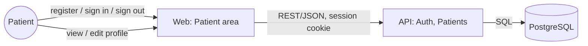
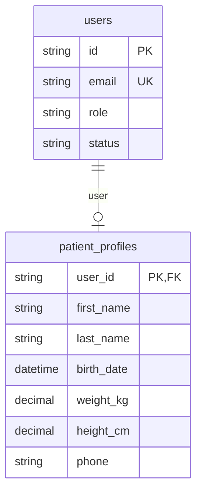

# Patient

> Accounts, sign-in/out, and profile are done (`add-authentication`). Doctor discovery and
> guided matching, booking/reschedule/cancel, in-app notifications, the consultation workspace,
> and the medical records/prescriptions view are planned for later changes.

## Module Overview

A visitor registers as a patient with an email, password, and name; the account is signed in
immediately (server-side session, `httpOnly` cookie — see
[Authentication & Authorization](/architecture/auth)). The patient area has its own navigation,
an initials avatar, and sign-out (this device or all devices). Patients view and edit their own
profile — name, birthday, weight, height, phone, emergency contact, and basic medical history —
and the patient home page prompts them to finish it until the required fields (name, birthday,
weight, height, phone) are all set.

## L2 Container View

Reuses the [C4 L2 Container](/architecture/c4-container) diagram's `web` and `api` containers —
no new container is introduced. The flows this slice adds:

## Data Model

The patient-owned slice of the full [Data Model](/architecture/data-model):

Profile completeness (name, birthday, weight, height, phone all set) is computed on read, not
stored — see [Authentication & Authorization](/architecture/auth) for the account/session model
this all sits behind.
