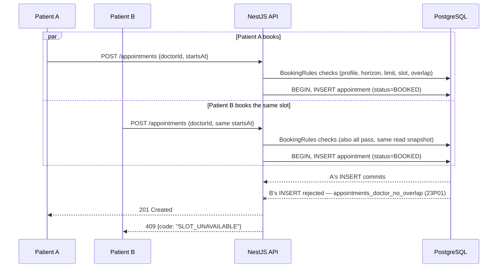
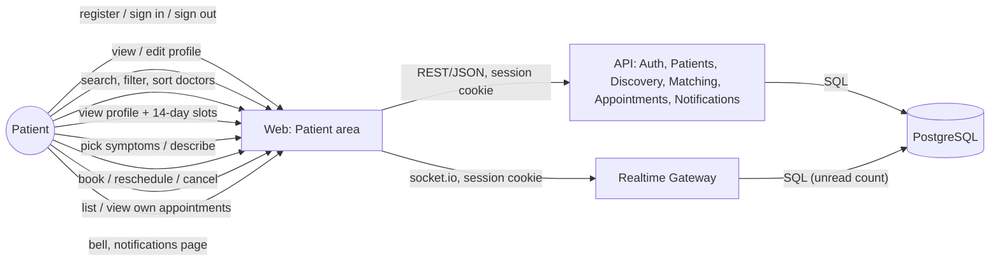
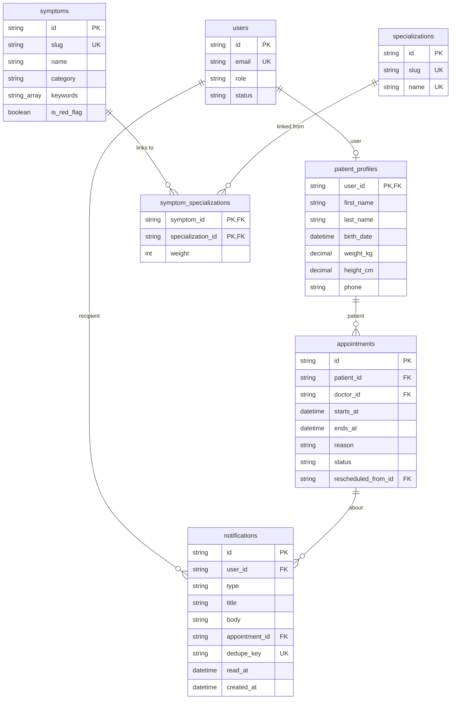

# Patient

> Accounts, sign-in/out, profile, doctor discovery, guided symptom matching, booking/
> reschedule/cancel, and in-app notifications are done (`add-authentication`,
> `add-doctor-availability`, `add-doctor-discovery`, `add-appointment-booking`,
> `add-notifications`). The consultation workspace and the medical records/prescriptions view are
> planned for later changes.

## Module Overview

A visitor registers as a patient with an email, password, and name; the account is signed in
immediately (server-side session, `httpOnly` cookie — see
[Authentication & Authorization](/architecture/auth)). The patient area has its own navigation,
an initials avatar, and sign-out (this device or all devices). Patients view and edit their own
profile — name, birthday, weight, height, phone, emergency contact, and basic medical history —
and the patient home page prompts them to finish it until the required fields (name, birthday,
weight, height, phone) are all set.

Once signed in, a patient finds a doctor one of two ways:

- **Find a doctor** — a search over approved, active doctors by name or specialization, with a
  specialization filter, an "available between" filter (today / next 3, 7, or 14 days / any), and
  sorting by soonest availability, name, or years of experience. Each result shows the doctor's
  next available slot within 14 days. Opening a doctor shows their full profile and a 14-day slot
  picker, grouped by date and shown in the patient's own time zone.
- **Find care** — guided matching. The patient picks symptoms from a categorized catalog and/or
  describes them in free text; the API scores specializations and ranks doctors with a
  deterministic, explainable algorithm (no external AI). A red-flag symptom shows an emergency
  banner first and hides the doctor list until the patient acknowledges it.

Both paths only ever surface doctors who are `APPROVED` and whose account is `ACTIVE` — the same
visibility rule the slots endpoint already used, now shared by search, the profile view, and
matching (`visibleDoctorWhere`/`isVisibleDoctor` in `apps/api/src/doctors/doctor-visibility.ts`).

## Booking an appointment

From a doctor's profile page, the patient picks a slot and opens a booking confirmation
(`/patient/doctors/:doctorId/book?start=<iso>&symptoms=<ids>`), which shows the doctor, the date
and time in the patient's own time zone, the consultation length, and a reason field — prefilled
as "Symptoms: Headache, Cough. " when symptoms were carried over from **Find care**, and always
editable. Submitting calls `POST /appointments`, which is accepted only when all of the following
hold, checked in this order by `BookingRules.assertBookable`
(`apps/api/src/appointments/booking-rules.ts`), the single module both booking and rescheduling
share so the rules can't diverge:

1. the patient's own profile is complete
2. the doctor is visible (`APPROVED` and `ACTIVE`) — otherwise `404`, the same non-disclosure as
   discovery
3. the start is at most 60 days ahead (`BEYOND_BOOKING_HORIZON`)
4. the patient has fewer than 5 upcoming `BOOKED` appointments (`BOOKING_LIMIT_REACHED`)
5. the start exactly matches a slot `generateSlots` would currently return for that doctor
   (`SLOT_UNAVAILABLE`) — reusing the same slot calculation the doctor availability page and the
   slot picker call, so "available" never means two different things
6. the time doesn't overlap the patient's own other `BOOKED` appointments (`PATIENT_CONFLICT`)

See [API Conventions](/architecture/api-conventions) for the full error `code` catalogue. On
`SLOT_UNAVAILABLE` the booking page says the time was just taken and refreshes the slot list; on
an incomplete profile it links to the profile page instead of allowing submission.

`/patient/appointments` lists the patient's own appointments in **Upcoming** (`BOOKED`, not yet
ended, soonest first) and **Past** (everything else, most recent first) tabs, with a status badge
and, per appointment, **Reschedule** (opens the same doctor's slot picker, 14 days out) and
**Cancel** (optional reason) — each disabled with an explanation when the rules don't allow it
(reschedule closes 2 hours before the start; cancel closes once the appointment starts or it's no
longer `BOOKED`). `/patient/appointments/:id` shows one appointment's full detail, including its
reschedule/cancellation history.

Rescheduling (`POST /appointments/{id}/reschedule`) re-runs the same six checks against the new
slot — excluding the appointment being rescheduled from the limit and overlap checks — then, in
one transaction, cancels the original (reason "Rescheduled") and inserts a new `BOOKED` row that
references it via `rescheduledFromId`, so the original slot becomes available again immediately.

### No double-booking, even under a race

The checks above are read-then-decide, not atomic, so two concurrent requests for the same slot
could both pass them. The database is the final guard: two `EXCLUDE USING gist` constraints on
`appointments` (added by hand in the `add_appointments` migration, since Prisma's schema language
can't express one — see [Data Model](/architecture/data-model)) reject any second `INSERT` whose
`[starts_at, ends_at)` range overlaps an existing `BOOKED` row for the same doctor or the same
patient, at the database level, regardless of what the service layer already checked. The service
catches that constraint violation (`23P01`) and rethrows it as the same `SLOT_UNAVAILABLE` /
`PATIENT_CONFLICT` code a pre-insert check would have produced, so the loser of the race gets an
ordinary `409`, not a `500`.

## Notifications

Booking, rescheduling, or having an appointment cancelled by the doctor notifies the patient
("Booking confirmed", "Reschedule confirmed", "Appointment cancelled"), plus 24h/1h reminders
before every `BOOKED` appointment — delivered live while signed in, and always visible in the
notification bell and `/patient/notifications`. See
[Notifications & Real-time](/architecture/realtime) for the event → transaction → commit →
delivery model and the socket.io gateway.

## L2 Container View

Reuses the [C4 L2 Container](/architecture/c4-container) diagram's `web` and `api` containers —
no new container is introduced. The flows this slice adds:

## Data Model

The patient-owned slice of the full [Data Model](/architecture/data-model), plus the read-only
symptom catalog guided matching scores against:

Profile completeness (name, birthday, weight, height, phone all set) is computed on read, not
stored — see [Authentication & Authorization](/architecture/auth) for the account/session model
this all sits behind. The symptom catalog is reference data shipped by a migration
(`20260925103000_add_symptom_catalog`), the same pattern as the specialization catalog: fixed
UUIDs, present in every environment without a separate seeding step, and read-only (nothing in the
app writes to it).

## Matching algorithm

`match()` in `apps/api/src/matching/matching-engine.ts` is a pure function — no database, no
clock — over the symptom catalog and a pre-fetched list of visible doctors (with their
specializations and next available slot, computed by the same `NextSlotService` search uses). The
API layer (`MatchingService`) loads that data, computes the patient's age from their profile's
birthday, and calls it.

1. Symptoms passed by ID are marked **selected**. The free-text description is normalized
   (lowercased, punctuation replaced with spaces, whitespace collapsed) and checked against every
   catalog symptom's keywords as whole words/phrases; matches are marked **described**. A symptom
   counts once even if it's both selected and described.
2. Each specialization's score is the sum of its weights to every matched symptom.
3. If the patient is under 18, Pediatrics is boosted to 4 above the current highest score (not
   summed with any score it already had from a matched symptom — the higher of the two wins).
4. If nothing matched, General Practice gets a score of 1 with a "no specific match" reason.
5. The top three specializations, by score then name, are returned with their reasons (each a
   symptom → specialization pair, or an age/default reason with no symptom).
6. Doctors are approved, active doctors with at least one of those three specializations, ranked
   by their best matching specialization's score, then soonest next available slot within 14 days
   (no slot sorts last), then name — at most 10.

Any matched symptom marked a red flag makes the response `urgent`, with a message naming the
red-flag symptoms; specializations and doctors are still returned so the patient isn't stuck on a
warning with nowhere to go. Nothing about the request is persisted — booking (a later change)
decides whether to carry the selected symptoms forward via the URL.

### Worked example: Headache + Cough

An adult patient selects **Headache** (Neurology 3, General Practice 1) and **Cough**
(Pulmonology 2, General Practice 2):

| Specialization    | Score | Why                                  |
| ------------------ | ----- | ------------------------------------- |
| General Practice   | 3     | Headache (1) + Cough (2)              |
| Neurology           | 3     | Headache (3)                          |
| Pulmonology         | 2     | Cough (2)                             |

General Practice and Neurology tie at 3; ties break by name, so General Practice ranks first,
then Neurology, then Pulmonology. Doctors are then drawn from those three specializations, ranked
by their own best-matching score and soonest slot.
