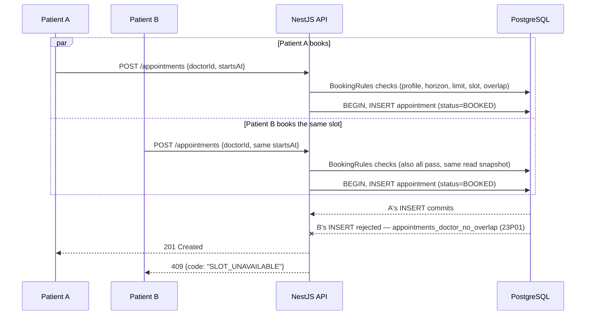
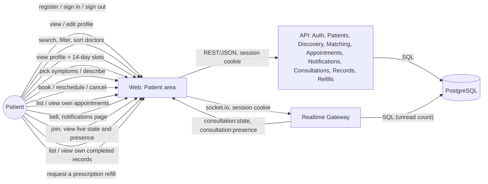
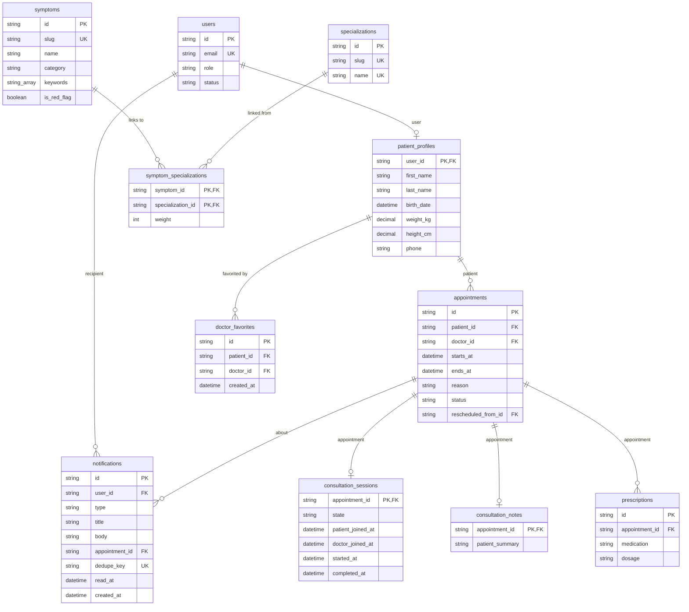

# Patient

> Accounts, sign-in/out, profile, doctor discovery, guided symptom matching, booking/
> reschedule/cancel, in-app notifications, the consultation workspace, and medical records are
> done (`add-authentication`, `add-doctor-availability`, `add-doctor-discovery`,
> `add-appointment-booking`, `add-notifications`, `add-consultations-and-records`).

## Module Overview

A visitor registers as a patient with an email, password, and name; the account is signed in
immediately (server-side session, `httpOnly` cookie — see
[Authentication & Authorization](/architecture/auth)). The patient area has its own navigation and
an initials-avatar account menu (Profile, Sign out); signing out of all devices lives in the
Profile page's Security card. Patients view and edit their own
profile — name, birthday, weight, height, phone, emergency contact, and basic medical history —
and the patient home page prompts them to finish it until the required fields (name, birthday,
weight, height, phone) are all set.

Once signed in, a patient finds a doctor one of two ways:

- **Find a doctor** — a search over approved, active doctors by name or specialization that
  updates as the patient types (debounced, no search button), with a specialization filter, an
  "Available on" range calendar (one month at a time with arrows, today through the next 13 days;
  pick a start and end day, or a single day, then Apply — the range of local days is sent as an
  `availableFrom`/`availableTo` instant range), and sorting by soonest availability, years of
  experience, or highest rating (the API also accepts a name sort; the page's Sort by control just
  doesn't offer it). Search, filters, and the picked range live in the URL. Each result shows the
  doctor's average rating and review count (or "No reviews yet") alongside their
  next available slot within 14 days, or, for a doctor who has paused new bookings
  (`acceptingBookings: false` — see [Doctor](/modules/doctor)), a plain "Not accepting bookings"
  notice in its place; that doctor is still listed, just excluded from a range-filtered search since
  they have no bookable time. Opening a doctor shows their full profile — including the same
  not-accepting notice in place of the slot picker when it applies — and a 14-day slot picker,
  grouped by date and shown in the patient's own time zone.
- **Find care** — guided matching. The patient picks symptoms from a categorized catalog and/or
  describes them in free text; the API scores specializations and ranks doctors with a
  deterministic, explainable algorithm (no external AI). A red-flag symptom shows an emergency
  banner first and hides the doctor list until the patient acknowledges it.

Both paths only ever surface doctors who are `APPROVED` and whose account is `ACTIVE` — the same
visibility rule the slots endpoint already used, now shared by search, the profile view, and
matching (`visibleDoctorWhere`/`isVisibleDoctor` in `apps/api/src/doctors/doctor-visibility.ts`).

## Booking an appointment

From a doctor's profile page, the patient picks a slot and opens a booking confirmation
(`/patient/doctors/:doctorId/book?start=<iso>&symptoms=<ids>`), which shows the doctor, the date
and time in the patient's own time zone, the consultation length, and a reason field — prefilled
as "Symptoms: Headache, Cough. " when symptoms were carried over from **Find care**, and always
editable. Submitting calls `POST /appointments`, which is accepted only when all of the following
hold, checked in this order by `BookingRules.assertBookable`
(`apps/api/src/appointments/booking-rules.ts`), the single module both booking and rescheduling
share so the rules can't diverge:

1. the patient's own profile is complete
2. the doctor is visible (`APPROVED` and `ACTIVE`) — otherwise `404`, the same non-disclosure as
   discovery
3. the doctor is currently accepting bookings (`DOCTOR_NOT_ACCEPTING_BOOKINGS`) — see
   [Doctor](/modules/doctor)'s "In"/"Out" toggle; a doctor pausing bookings mid-request is caught
   here, in the same transaction as the write
4. the start is at most 60 days ahead (`BEYOND_BOOKING_HORIZON`)
5. the patient has fewer than 5 upcoming `BOOKED` appointments (`BOOKING_LIMIT_REACHED`)
6. the start exactly matches a slot `generateSlots` would currently return for that doctor
   (`SLOT_UNAVAILABLE`) — reusing the same slot calculation the doctor availability page and the
   slot picker call, so "available" never means two different things
7. the time doesn't overlap the patient's own other `BOOKED` appointments (`PATIENT_CONFLICT`)

See [API Conventions](/architecture/api-conventions) for the full error `code` catalogue. On
`SLOT_UNAVAILABLE` the booking page says the time was just taken and refreshes the slot list; on
an incomplete profile it links to the profile page instead of allowing submission.

`/patient/appointments` lists the patient's own appointments in **Upcoming** (`BOOKED`, not yet
ended, soonest first) and **Past** (everything else, most recent first) tabs, with a status badge
and, per appointment, **Reschedule** (opens the same doctor's slot picker, 14 days out) and
**Cancel** (optional reason) — each disabled with an explanation when the rules don't allow it
(reschedule closes 2 hours before the start; cancel closes once the appointment starts or it's no
longer `BOOKED`). `/patient/appointments/:id` shows one appointment's full detail, including its
reschedule/cancellation history.

Rescheduling (`POST /appointments/{id}/reschedule`) re-runs the same six checks against the new
slot — excluding the appointment being rescheduled from the limit and overlap checks — then, in
one transaction, cancels the original (reason "Rescheduled") and inserts a new `BOOKED` row that
references it via `rescheduledFromId`, so the original slot becomes available again immediately.

### No double-booking, even under a race

The checks above are read-then-decide, not atomic, so two concurrent requests for the same slot
could both pass them. The database is the final guard: two `EXCLUDE USING gist` constraints on
`appointments` (added by hand in the `add_appointments` migration, since Prisma's schema language
can't express one — see [Data Model](/architecture/data-model)) reject any second `INSERT` whose
`[starts_at, ends_at)` range overlaps an existing `BOOKED` row for the same doctor or the same
patient, at the database level, regardless of what the service layer already checked. The service
catches that constraint violation (`23P01`) and rethrows it as the same `SLOT_UNAVAILABLE` /
`PATIENT_CONFLICT` code a pre-insert check would have produced, so the loser of the race gets an
ordinary `409`, not a `500`.

## Booking for a dependent

`/patient/dependents` (reachable from Profile) lets a patient add people it books on behalf of —
a child, a parent, a spouse, or someone else — each with their own name, birthdate, relationship,
and medical history (conditions, allergies, current medications), tracked separately from the
account holder's own profile and from each other (`add-dependent-booking`). A dependent has no
login of their own; the account holder does everything for them. Removing a dependent hides them
from future booking without deleting any appointment, message, or record already associated with
them.

The booking confirmation gains a "Who is this appointment for?" choice (the account holder, or one
of their active dependents); the chosen dependent is carried through rescheduling. Appointment
cards, the consultation workspace, and records all show who the appointment was actually for — the
dependent's name and age, not the account holder's, wherever a doctor needs to know who they're
treating — while every access-control check (joining, messaging, cancelling, managing the booking)
still keys off the account, since that's who is actually signed in. The account holder's own
double-booking and 5-upcoming-appointment limit apply across every dependent's appointments
combined, not per dependent: the account holder is who is physically present, so they cannot be
double-booked across their own and a dependent's visits either.

## Favorite doctors and Book again

A patient can favorite/unfavorite an approved, active doctor from a search result card or their
profile (a toggleable heart) — a purely organizational bookmark with **no effect** on search
ranking, sorting, or the deterministic specialty-matching algorithm (`add-doctor-favorites`). **Find
a doctor** has a "Favorites only" filter, combinable with its other filters (search text,
specialization, sort), that narrows the list to just favorited doctors using the same live summary
an ordinary search result shows (specializations, experience, accepting-bookings state, next
available slot, rating) — computed client-side from the favorites list rather than a server query,
so a favorited doctor who is later suspended, rejected, or deactivated is silently dropped rather
than shown as broken, and the "Available on" date filter doesn't apply in this mode. A patient can
favorite at most 50 doctors at once.

The appointments list (upcoming and past) offers a "Book again" shortcut straight into that
doctor's profile, preselecting the same attendee (the account holder or the specific dependent)
the appointment was originally for — skipping **Find a doctor**'s search/filter/guided-matching
step entirely (favoriting a doctor doesn't prefill an attendee this way; a favorited doctor's card
still just links to their profile like any other search result). This is a pure URL prefill
(`?dependent=<id>`) read by the doctor profile and booking confirmation pages, not a new endpoint;
the confirmation page
validates the ID against the patient's own *current* dependents before preselecting it, falling
back to "Myself" if it no longer matches (e.g. the dependent was since removed) — the booking call
itself still re-validates ownership server-side regardless.

## Notifications

Booking, rescheduling, or having an appointment cancelled by the doctor notifies the patient
("Booking confirmed", "Reschedule confirmed", "Appointment cancelled"), plus 24h/1h reminders
before every `BOOKED` appointment and, once a consultation is completed, "Consultation summary
available" — delivered live while signed in, and always visible in the notification bell and
`/patient/notifications`. An appointment cancelled by an administrator, or by the doctor's own
account being deactivated, notifies the patient the same way but states it was "cancelled by the
platform" (see [Admin](/modules/admin#appointment-oversight)); a patient's own account being
deactivated cancels their own upcoming appointments without notifying the patient about it (they
already know — see [Admin](/modules/admin#user-management)). See
[Notifications & Real-time](/architecture/realtime) for the event → transaction → commit →
delivery model and the socket.io gateway.

## Joining and the consultation workspace

Appointment cards, the appointment detail page, and `/consultations/:appointmentId` itself all
show a "Join consultation" action from 15 minutes before the appointment starts until 30 minutes
after it ends (`isJoinable`/`JOIN_OPENS_BEFORE_MINUTES`/`JOIN_CLOSES_AFTER_MINUTES` in
`apps/web/src/lib/consultations/consultation-window.ts`, kept equal to the API's own constants by
a test). Opening the workspace before the window shows a live countdown instead.

The workspace page auto-joins on mount (idempotent — rejoining has no effect), subscribes over the
shared realtime socket, and shows a state timeline (`SCHEDULED` → `JOINED` → `IN_PROGRESS` →
`COMPLETED`) and presence dots for both participants. The patient sees "Waiting for the
doctor…", then "In progress" once the doctor starts (pushed live, no reload — see
[Notifications & Real-time](/architecture/realtime#consultation-presence-add-consultations-and-records)),
then, once the doctor completes it, the patient summary and prescriptions right there in the
workspace. See [Clinical Access](/architecture/clinical-access) for the full state machine and who
can see what.

While `JOINED` or `IN_PROGRESS`, the workspace also embeds a live video call with the doctor, via
Jitsi's public `meet.jit.si` server against a per-appointment room name the API derives (not
guessable from the appointment ID). This is a deliberate, documented exception to the
standalone-runtime rule made for prototype purposes — see the README's "Known deviations."

## Messaging

Each `BOOKED` or `COMPLETED` appointment has its own text message thread with the doctor, shown as
a "Messages" card on both the appointment detail page and the consultation workspace itself (next
to the video call) — the same thread either way (`add-consultation-messaging`). Sending is only
offered while the appointment is `BOOKED`; a completed appointment's thread stays visible
read-only, and a cancelled or not-held appointment shows no thread at all. Messages are stored in
Postgres and delivered live over the same realtime socket the workspace uses, and each one raises
a "New message" in-app notification for the recipient — no external chat/SaaS provider, and
administrators only ever see a message count and last-message time (never the content), the same
non-disclosure posture as clinical notes.

## Medical records

`/patient/records` lists completed consultations for the account holder and every dependent
combined, newest first, each showing the doctor, date, patient summary, and who it was for; a
filter narrows it to just the account holder ("Myself") or one specific dependent.
`/patient/records/:appointmentId` shows the full record — summary, findings/assessment/plan, and
prescriptions — in a print-friendly layout (`window.print()` with the role navigation hidden via
`print:hidden`, so a printed copy is a clean single column). A consultation that is not yet
completed, or belongs to another account, `404`s the same way a non-existent one would (see
[Clinical Access](/architecture/clinical-access)).

## Requesting a prescription refill

From `/patient/records/:appointmentId`, each prescription on a completed consultation gets a
"Request refill" action (hidden while a request is already `PENDING`) with an optional note to the
doctor; the request's status and the doctor's note, if any, show inline next to that prescription
(`add-prescription-refills`). Approving or denying never reopens the original, locked consultation
note or edits the prescription itself — the refill request's own status/note *is* the "this was
renewed" record. A refill can be requested for a dependent's record too, scoped the same way the
rest of that dependent's history is.

## Rating a doctor

Once a consultation is `COMPLETED`, the appointment detail page offers a "Rate this visit" prompt —
a 1-5 star rating and an optional comment, editable afterward by resubmitting
(`add-doctor-reviews`). A doctor's visible reviews and average rating show on their search card and
profile page; a review an administrator has hidden (see
[Admin](/modules/admin#review-moderation)) drops out of that average and list immediately. Rating
is purely informational — it never affects the deterministic specialty-matching algorithm and only
changes result order when a patient explicitly picks the "Highest rated" sort.

## L2 Container View

Reuses the [C4 L2 Container](/architecture/c4-container) diagram's `web` and `api` containers —
no new container is introduced. The flows this slice adds:

## Data Model

The patient-owned slice of the full [Data Model](/architecture/data-model), plus the read-only
symptom catalog guided matching scores against:

Profile completeness (name, birthday, weight, height, phone all set) is computed on read, not
stored — see [Authentication & Authorization](/architecture/auth) for the account/session model
this all sits behind. The symptom catalog is reference data shipped by a migration
(`20260925103000_add_symptom_catalog`), the same pattern as the specialization catalog: fixed
UUIDs, present in every environment without a separate seeding step, and read-only (nothing in the
app writes to it). `consultation_sessions`/`consultation_notes`/`prescriptions` (trimmed here to
their patient-relevant fields — see the [full Data Model](/architecture/data-model) and
[Clinical Access](/architecture/clinical-access) for the complete schema and access rules) hold the
workspace state and its outcome; a patient only ever sees the note and prescriptions once the
session is `COMPLETED`.

## Matching algorithm

`match()` in `apps/api/src/matching/matching-engine.ts` is a pure function — no database, no
clock — over the symptom catalog and a pre-fetched list of visible doctors (with their
specializations and next available slot, computed by the same `NextSlotService` search uses). The
API layer (`MatchingService`) loads that data, computes the patient's age from their profile's
birthday, and calls it.

1. Symptoms passed by ID are marked **selected**. The free-text description is normalized
   (lowercased, punctuation replaced with spaces, whitespace collapsed) and checked against every
   catalog symptom's keywords as whole words/phrases; matches are marked **described**. A symptom
   counts once even if it's both selected and described.
2. Each specialization's score is the sum of its weights to every matched symptom.
3. If the patient is under 18, Pediatrics is boosted to 4 above the current highest score (not
   summed with any score it already had from a matched symptom — the higher of the two wins).
4. If nothing matched, General Practice gets a score of 1 with a "no specific match" reason.
5. The top three specializations, by score then name, are returned with their reasons (each a
   symptom → specialization pair, or an age/default reason with no symptom).
6. Doctors are approved, active doctors with at least one of those three specializations, ranked
   by their best matching specialization's score, then soonest next available slot within 14 days
   (no slot sorts last), then name — at most 10.

Any matched symptom marked a red flag makes the response `urgent`, with a message naming the
red-flag symptoms; specializations and doctors are still returned so the patient isn't stuck on a
warning with nowhere to go. Nothing about the request is persisted — booking (a later change)
decides whether to carry the selected symptoms forward via the URL.

### Worked example: Headache + Cough

An adult patient selects **Headache** (Neurology 3, General Practice 1) and **Cough**
(Pulmonology 2, General Practice 2):

| Specialization    | Score | Why                                  |
| ------------------ | ----- | ------------------------------------- |
| General Practice   | 3     | Headache (1) + Cough (2)              |
| Neurology           | 3     | Headache (3)                          |
| Pulmonology         | 2     | Cough (2)                             |

General Practice and Neurology tie at 3; ties break by name, so General Practice ranks first,
then Neurology, then Pulmonology. Doctors are then drawn from those three specializations, ranked
by their own best-matching score and soonest slot.
